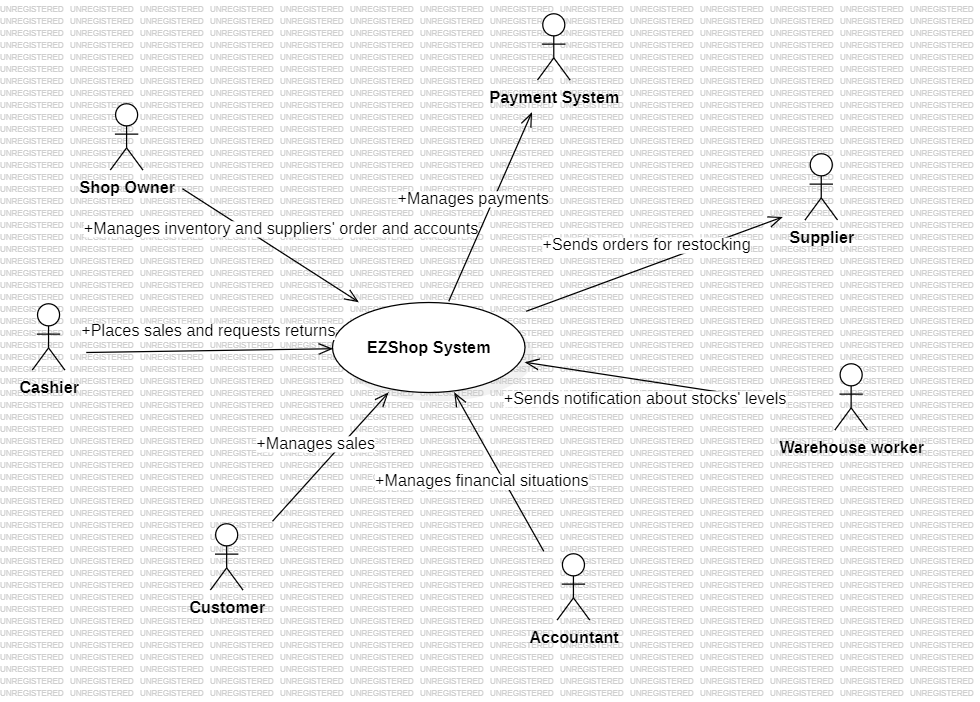
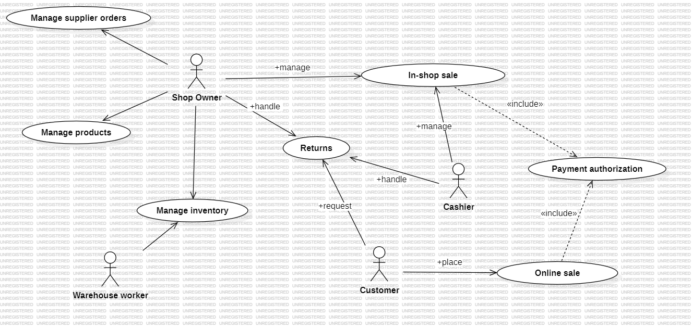
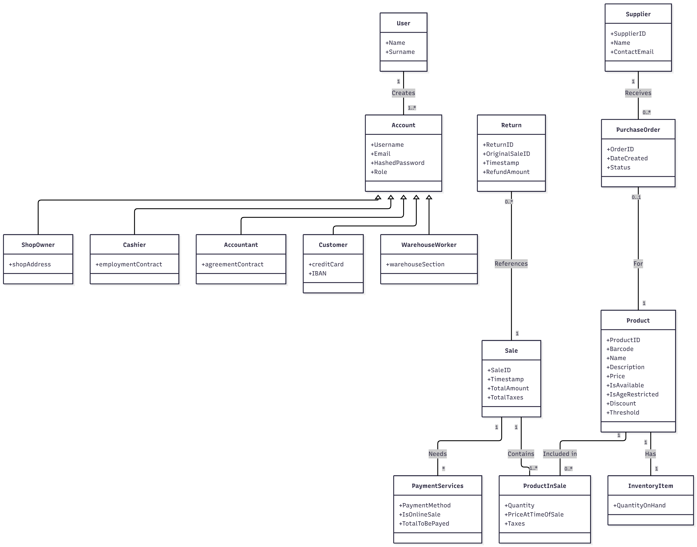
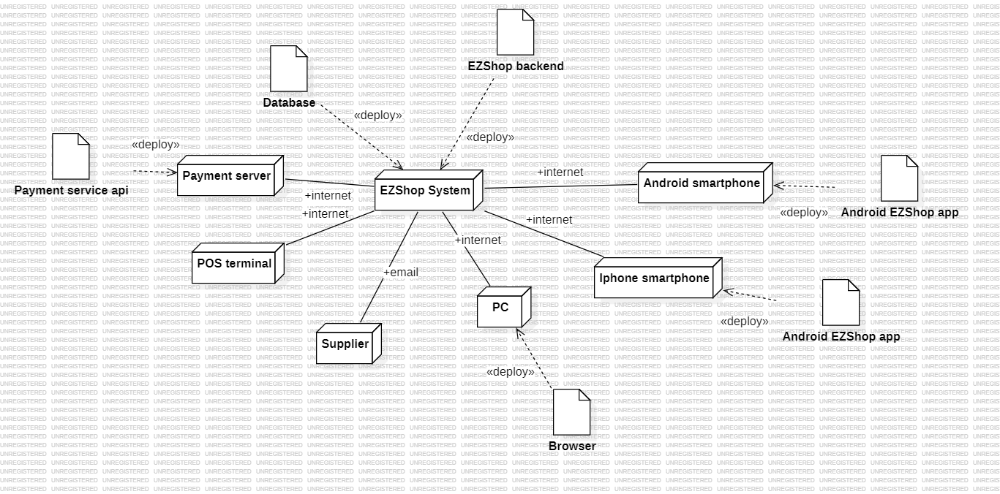

# Requirements Document - EZShop

Date: 24/10/2025

Version: 1.0.0

| Version number | Change |
| :------------: | :----: |
|                |        |

# Contents

- [Requirements Document - EzShop](#requirements-document)
- [Contents](#contents)
- [Informal description](#informal-description)
- [Business model](#business-model)
- [Stakeholders](#stakeholders)
- [Context Diagram and interfaces](#context-diagram-and-interfaces)
  - [Context Diagram](#context-diagram)
  - [Interfaces](#interfaces)
- [Functional and non functional requirements](#functional-and-non-functional-requirements)
  - [Functional Requirements](#functional-requirements)
  - [Non Functional Requirements](#non-functional-requirements)
- [Table of Rights](#table-of-rights)
- [Use case diagram and use cases](#use-case-diagram-and-use-cases)
  - [Use case diagram](#use-case-diagram)
    - [Use case 1, UC1](#use-case-1-uc1)
      - [Scenario 1.1](#scenario-11)
      - [Scenario 1.2](#scenario-12)
      - [Scenario 1.x](#scenario-1x)
    - [Use case 2, UC2](#use-case-2-uc2)
    - [Use case x, UCx](#use-case-x-ucx)
- [Glossary](#glossary)
- [System Design](#system-design)
- [Hardware Software architecture](#Hardware-software-architecture)

# Informal description

Small shops require a simple application to support the owner or manager. A small shop (ex a food shop) occupies 50-200 square meters, sells 500-2000 different item types, has two or a few more cash registers. 
EZShop is a software application to:
* manage sales
* manage inventory
* manage orders to suppliers
* support accounting

In the following describe the requirements of the EZShop application. 
You are free to define the application as you deem more useful and effective for the stakeholders. 
You are also free to modify the structure of the document when needed.
The document will be evaluated considering the typical defects in requirements (omissions, ambiguities, contradictions, etc), and syntactic errors in the formalism used (UML diagrams). 
Consider that the document should be delivered to another team (unknown to you)
 which will be in charge of designing and implementing the system. The design team should be able to proceed only with the information in the document.

# Business Model

The EZShop system is designed to be a high-value, affordable, and scalable solution for small, independent retailers. The business model is centered on providing a product that directly increases the profitability and operational efficiency of the target shops (Convenience Stores, Small Grocers, Local Hardware Stores, Pet Stores, Small Bookstores/Toy Stores).

### 1\. Value Proposition

* **Increase Profitability:** Real-time inventory (FR5) prevents lost sales/overstocking. Accurate tracking ensures correct margins.  
* **Improve Operational Efficiency:** Fast sale speeds checkout. Automated inventory (FR5) and simplified ordering reduce manual work.  
* **Enable Data-Driven Decisions:** Clear reports offer immediate insights into sales, profitability, and reordering needs.  
* **Reduce Risk & Errors:** Minimizes checkout mistakes, reduces stock shrinkage, and ensures accurate sales data for compliance.

### 2\. Revenue Streams

**2.1. SaaS (Software as a Service)**

* **Recurring Fee:** Monthly/Annual payment.  
* **Tiered Plans:** Different feature levels (e.g., "Basic" \- 1 register, 500 items; "Pro" \- 5 registers, 2000 items, advanced reports).  
* **Cloud-Based:** EZShop hosts the server and database

**2.2. Perpetual License** 

* **Payment Structure:** A single, upfront payment covers the software license (One-Time Fee).  
* **Deployment:** The software, including the server and database, is deployed locally on the customer's premises (Local Deployment) and is downloadable on smartphones, laptops, tablets and PCs for online shopping.  
* **Support & Updates:** Customers have the option to purchase a recurring annual fee for maintenance, which provides access to software updates and dedicated technical support (Optional Maintenance Fee).

### 3\. Distribution Channels:

* **Direct Sales:** EZShop's dedicated website will offer SaaS and perpetual licenses, allowing owners to learn about pricing and sign up directly.  
* **Reseller Partnerships:** Partner with POS hardware vendors (scanners, printers, etc.) to bundle EZShop as a complete system.  
* **IT Support Resellers:** Partner with local IT support firms that service small businesses to resell and install the EZShop system for their clients.

# Stakeholders

| Stakeholder name | Description |
| :----: | :---- |
| **Shop Owner** | The Shop Owner has full administrative access and oversees all business operations such as staff management, pricing, inventory, profitability and supplier relationships. They prioritize an affordable, reliable system with clear reports (sales, stock, profit) for effective business management. |
| **Cashier / Shop Employee** | The Cashier performs sales and returns. They may view inventory levels but cannot modify them. Their interest is in a system that is fast, easy to learn, and minimizes errors. |
| **Customer** | The end-user of the shop. Customers interact indirectly with the system through the checkout process or directly via the mobile/online application.. Their interests are a fast and error-free checkout, accurate pricing, and a clear receipt. |
| **Supplier** | The external B2B entity that provides the shop with its products Their interest is receiving clear, accurate, and timely Purchase Orders from the system. |
| **Accountant** | The Accountant has read-only access to financial data and is responsible for tax tracking and preparing financial statements. Their interest is the ability to easily access and export accurate, detailed financial reports. |
| **Maintenance staff** | The Maintenance Staff provides technical support and system updates. They do not manage business data but ensure the system operates correctly. |
| **External Payment System** | The third-party service and hardware (e.g., credit card terminal/provider) that processes electronic payments via a secure interface. This is an external system actor. Its "interest" is receiving correct payment totals from EZShop and returning a clear "approved" or "denied" status via a secure interface. |
| **Warehouse worker** | People responsible to count the items’ stock and to manage the incoming supplier products |
| **Products** | Items in the shop inventory which have many attributes: name, description, bar code, boolean value which indicates if it is available or not, possible discounts, price. |

# Context Diagram and interfaces

## Context Diagram

## Interfaces

| Actor | Logical Interface | Physical Interface |
| :----: | :---- | :---- |
| **Cashier** | **Point of Sale (POS) UI:** A graphical user interface designed for fast transaction processing.  | **Cash Register Terminal:** A dedicated computer, barcode scanner, thermal receipt printer and a physical Cash Drawer. |
| **Shop Owner** | **Management Dashboard:** A secure, web-based administrative interface. It provides access to all management functions: product catalog, inventory levels, supplier orders, sales reports, and user account management. | **PC, Laptop, or Tablet:** Any device with a modern web browser and an internet connection. |
| **Accountant** | **Reporting Interface:** A secure, web-based interface focused on financial data. It allows for viewing and exporting reports on sales, taxes, and purchases. | **PC or Laptop:** A standard computer with a web browser.  |
| **Supplier System** | **Order Interface:** An automated or manual interface for sending a Purchase Order. | **Any device with email system:** The system generates and sends a formatted email, often with a **PDF** attachment of the Purchase Order, to the supplier's contact email address. |
| **Customer** | **Mobile app:** An application where the customer can independently order the items of the shop | **Pc, laptop, tablet, smartphone:** any device with the application installed |
| **Warehouse worker** | **Notification interface:** an interface with which the worker can notify anything to the system | **Main computer:** the main computer from where the system will receive important notification from the Warehouse workers |
| **Payment System** | **Credit card circuit api:** terminal interface, online bank system | Credit card reader, cash drawer, mobile app/ web browser |

# Functional and non functional requirements

## Functional Requirements

| ID | Description | Subrequirements |
| :---- | :---- | :---- |
| **FR1** | **Manage In-Store Sales** | **FR1.1: Add Items** <ul><li>**FR1.1.1:** Add product via barcode scanning</li> <li>**FR1.1.2:** Add product via manual search</li> <li>**FR1.1.3:** Update and display subtotal</li> <li>**FR1.1.4:** Require ID for restricted items</li></ul> **FR1.2: Remove Items**  <ul><li>**FR1.2.1:** Remove product from the order</li> <li>**FR1.2.2:** Update subtotal after removal</li></ul> **FR1.3: Select Card Payment**  <ul><li>**FR1.3.1:** Send total amount to payment system</li> <li>**FR1.3.2:** Wait for approval or denial</li><li> **FR1.3.3:** Complete sale on approval</li><li> **FR1.3.4:** Display error on denial</li></ul> **FR1.4: Select Cash Payment**  <ul><li>**FR1.4.1:** Display total amount</li><li> **FR1.4.2:** Open cash drawer</li><li> **FR1.4.3:** Calculate change</li></ul> **FR1.5: Complete Sale** <ul><li> **FR1.5.1:** Generate sales receipt</li><li> **FR1.5.2:** Store transaction</li><li> **FR1.5.3:** Update inventory</li></ul> **FR1.6: Error Handling**  <ul><li> **FR1.6.1:** Unknown barcode error</li><li> **FR1.6.2:** Block incomplete payments</li><li> **FR1.6.3:** Notify POS hardware issues</li></ul> |
| **FR2** | **Manage Online Customer Orders** | **FR2.1: Add Items to Cart**  <ul><li>**FR2.1.1:** Add product to shopping cart</li><li> **FR2.1.2:** Display item name, price and updated subtotal</li></ul> **FR2.2: Remove Items from Cart**  <ul><li>**FR2.2.1:** Remove items from shopping cart</li><li> **FR2.2.2:** Update the subtotal accordingly</li></ul> **FR2.3: Checkout**  <ul><li>**FR2.3.1:** DIsplay the subtotal, taxes and final total</li></ul> **FR2.4: Select Payment Method** <ul><li>**FR2.4.1:** Select online payment method</li><li> **FR2.4.2:** Send the total amount to the Online Payment System</li><li> **FR2.4.3:** Complete the order only if payment is approved</li><li> **FR2.4.4:** Display an error message if payment is denied</li></ul> **FR2.5: Receipt** <ul><li>**FR2.5.1:** Generate a digital receipt</li><li> **FR2.5.2:** Send the receipt via email to the customer</li></ul> **FR2.6: Request Refound** <ul><li>**FR2.6.1:** Enable customer to request a refund for purchased items</li><li> **FR2.6.2:** Require a receipt or transaction ID for refounds</li><li> **FR2.6.3:** Forward the refund request to the Cashier/Owner for approval</li></ul> **FR2.7: Error Handling** <ul><li>**FR2.7.1:** Restore cart if payment fails</li><li> **FR2.7.2:** Payment system downtime message</li></ul> |
| **FR3** | **Manage Returns** | **FR3.1: Verify Return Eligibility** <ul><li>**FR3.1.1:** Validate existence of original purchase</li><li> **FR3.1.2:** Display the item details and the refundable amount</li><li> **FR3.1.3:** Notify the staff if the item is non-returnable or the sale cannot be found</li></ul> **FR3.2: Select Return Method** <ul><li>**FR3.2.1:** Provide option to choose a return method (in-store or courier)</li><li> **FR3.2.2:** For in-store returns, the system shall require presenting the physical receipt</li><li> **FR3.2.3:** For courier returns, the system shall require uploading a PDF receipt or providing the transaction ID</li></ul> **FR3.3: Approve or Reject Return** <ul><li>**FR3.3.1:** Enable authorized staff (Cashier/Owner) to approve or reject a return request</li><li> **FR3.3.2:** Record the decision and apply it to the transaction history</li></ul> **FR3.4: Process Refund** <ul><li>**FR3.4.1:** Support multiple refund types (cash, card, store credit)</li><li> **FR3.4.2:** Send refund request to the External Payment System (for card refunds)</li><li> **FR3.4.3:** Complete the refund only after receiving approval from the External Payment System</li><li> **FR3.4.4:** Notify the staff if the refund is denied (Error on denial)</li></ul> **FR3.5: Generate Return Receipt** <ul><li>**FR3.5.1:** Generate a return receipt for the customer</li><li> **FR3.5.2:** Store return receipts in the system database</li></ul> **FR3.6: Error Handling** <ul><li>**FR3.6.1:** Display an error when the provided receipt or transaction ID is invalid</li><li> **FR3.6.2:** Block incomplete refund</li><li> **FR3.6.3:** Notify the staff if required POS or payment hardware is not available</li></ul> |
| **FR4** | **Manage Products** | **FR4.1: Add Product** <ul><li>**FR4.1.1:** Enter product name, description, supplier, barcode, price, initial stock level</li><li> **FR4.1.2:** Validate unique barcode</li><li> **FR4.1.3:** Create product entry</li></ul> **FR4.2: Delete Product** <ul><li>**FR 4.2.1:** Delete selected product</li><li> **FR 4.2.2:** Prevent deletion if product is linked to completed transactions</li></ul> **FR4.3: Modify Product** <ul><li>**FR4.3.1:** Edit product name</li><li> **FR4.3.2:** Edit description</li><li> **FR4.3.3:** Edit supplier</li><li> **FR4.3.4:** Edit price</li><li> **FR4.3.5:** Add discounts</li><li> **FR4.3.6:** Add threshold</li><li> **FR4.3.7:** Validate fields before save</li></ul> **FR4.4: Availability** <ul><li>**FR4.4.1:** Automatically mark product as unavailable if stock\=0</li><li> **FR4.4.2:** Manually set unavailable</li></ul> **FR4.5: View Product** <ul><li>**FR4.5.1:** View full product details</li><li> **FR4.5.2:** View stock levels and supplier info</li></ul> **FR4.6: Error Handling** <ul><li>**FR4.6.1:** Missing field error</li><li> **FR4.6.2:** Invalid price error</li><li> **FR4.6.3:** Duplicate barcode error</li></ul>|
| **FR5** | **Manage Inventory** | **FR5.1:** **Automatic Stock Updates** <ul><li>**FR5.1.1:** Decrease stock after completing an in-store sale (FR1)</li><li> **FR5.1.2:** Decrease stock after completing an online sale (FR2)</li><li> **FR5.1.3:** Increase stock after a completed return (FR3)</li><li> **FR5.1.4:** Increase stock when items from supplier are confirmed (FR6)</li></ul> **FR5.2: Manual Stock Adjustments** <ul><li>**FR5.2.1:** Manually adjust stock levels for any product</li><li> **FR5.2.2:** Log every manual adjustment for auditing purposes</li></ul> |
| **FR6** | **Manage Supplier Orders** | **FR6.1: Create Supplier Orders** <ul><li>**FR6.1.1:** Create a new purchase order for selected products</li><li> **FR6.1.2:** Include product quantities, supplier information, and total cost</li><li> **FR6.1.3:** Save purchase orders as drafts before sending</li></ul> **FR6.2:** **Send Purchase Orders** <ul><li>**FR6.2.1:** Generate a formatted purchase order document (e.g., PDF)</li><li> **FR6.2.2:** Send purchase orders to suppliers via email</li><li> **FR6.2.3:** Mark purchase orders as “sent” after successful delivery</li></ul> **FR6.3: Automatic Restocking** <ul><li>**FR6.3.1:** Trigger automatic purchase orders when stock falls below threshold</li></ul> **FR6.4: Manage Order Status** <ul><li>**FR6.4.1:** Track purchase order states (draft, sent, delivered, completed)</li><li> **FR6.4.2:** Log changes in order status for auditing and traceability</li></ul> **FR6.5: Error Handling** <ul><li>**FR6.5.1:** Display error for missing or invalid supplier information</li><li> **FR6.5.2:** Display error if email delivery fails</li><li> **FR6.5.3:** Warn if received stock quantity does not match the purchase order</li></ul> |
| **FR7** | **Generate Reports** | **FR7.1: Daily Sales Summary** <ul><li>**FR7.1.1:** Produce a daily summary of all completed orders</li><li> **FR7.1.2:** Display total income for the day</li><li> **FR7.1.3:** Display total losses (e.g., returned items, discarded stock)</li><li> **FR7.1.4:** Display total taxes</li></ul> **FR7.2: Restock Notifications** <ul><li>**FR7.2.1:** Notify the Owner when an automatic restock order is generated</li></ul> **FR7.3: Financial Reports** <ul><li>**FR7.3.1:** Provide access to financial statistics (sales, taxes, refunds)</li><li> **FR7.3.2:** Allow exporting financial reports for accounting purposes</li></ul> **FR7.4: Error Handling** <ul><li>**FR7.4.1:** Display error if report data is incomplete or unavailable</li><li> **FR7.4.2:** Warn if report generation exceeds time limits</li><li> **FR7.4.3:** Notify the user if exporting fails</li></ul> |
| **FR8** | **Manage Users** | **FR8.1: Owner Account Creation** <ul><li>**FR8.1.1:** Create an Owner account during initial system setup</li><li> **FR8.1.2:** Allow the Owner to define the address of physical shop associated with the account</li></ul> **FR8.2: Cashier Accounts** <ul><li>**FR8.2.1:** Create Cashier accounts</li><li> **FR8.2.2:** Add employment contract</li><li> **FR8.2.3:** Require Cashiers to log in before accessing the POS</li><li> **FR8.2.4:** Restrict Cashier access to POS functions only</li></ul> **FR8.3: Accountant Accounts** <ul><li>**FR8.3.1:** Create Accountant accounts</li><li> **FR8.3.2:** Add agreement contract</li><li> **FR8.3.3:** Limit Accountant access to financial reports and related data</li></ul> **FR8.4: Customer Accounts** <ul><li>**FR8.4.1:** Allow account creation for online customers</li><li> **FR8.4.2:** Add credit card</li><li> **FR8.4.3:** Add IBAN</li><li> **FR8.4.4:** Limit customer account to placing orders and requesting refounds functions only</li><li> **FR8.4.5:** Store customer purchase history and digital receipts</li></ul> **FR8.5: Warehouse Worker Accounts** <ul><li>**FR8.5.1:** Create Warehouse worker accounts</li><li> **FR8.5.2:** Add warehouse section</li><li> **FR8.5.3:** Limit warehouse workers account to stocks function only</li></ul> **FR8.6: Account Deactivation and Deletion (Owner)** <ul><li>**FR8.6.1:** Deactivate or delete Cashier accounts</li><li> **FR8.6.2:** Deactivate or delete Customer accounts</li><li> **FR8.6.3:** Deactivate or delete Accountant accounts</li><li> **FR8.6.4:** Deactivate or delete Warehouse worker accounts</li></ul> **FR8.7: Error Handling** <ul><li>**FR8.7.1:** Display error when mandatory user information is missing</li><li> **FR8.7.2:** Display error for duplicate usernames or email addresses</li><li> **FR8.7.3:** Warn when user role assignment is invalid</li></ul> |
| **FR9** | **Manage Physical Stocks** | **FR9.1: Stock Corrections** <ul><li>**FR9.1.1:** Enable correcting digital stock levels</li><li> **FR9.1.2:** Log all corrections for auditing and traceability</li><li> **FR9.1.3:** Prevent corrections that result in negative stock quantities</li></ul> **FR9.2: Incoming Goods Verification** <ul><li>**FR9.2.1:** Record quantities received from supplier deliveries</li><li> **FR9.2.2:** Compare delivered quantities with purchase orders</li><li> **FR9.2.3:** Notify the Owner of delivery inconsistencies</li></ul> |
| **FR10** | **Managing financial issues** | **FR10.1: Track Financial Information** <ul><li>**FR10.1.1:** Record all sales transactions for financial reporting</li><li> **FR10.1.2:** Record all refunds and returns (FR3)</li><li> **FR10.1.3:** Record all restock orders and supplier payments (FR6)</li></ul> **FR10.2: Taxes and Accounting** <ul><li>**FR10.2.1:** Calculate applicable taxes on each sale</li><li> **FR10.2.2:** Include tax information in financial summaries</li><li> **FR10.2.3:** Provide tax data required for external accounting</li></ul> **FR10.3: Financial Reporting** <ul><li>**FR10.3.1:** Generate financial summary reports (income, expenses, refunds)</li><li> **FR10.3.2:** Provide detailed breakdowns of sales, losses, and taxes</li><li> **FR10.3.3:** Allow exporting financial reports for external accounting tools</li></ul> **FR10.4: Payment Reconciliation** <ul><li>**FR10.4.1:** Match digital transaction records with payment-system confirmations</li><li> **FR10.4.2:** Identify inconsistencies between POS payments and system records</li><li> **FR10.4.3:** Notify Owner and Accountant when mismatches occur</li></ul> **FR10.5: Financial Audit Support** <ul><li>**FR10.5.1:** Log all financial operations for audit purposes</li><li> **FR10.5.2:** Provide access to historical financial data</li><li> **FR10.5.3:** Prevent unauthorized modification of financial records</li></ul> **FR10.6: Error Handling** <ul><li>**FR10.6.1:** Display error for missing or inconsistent financial data</li><li> **FR10.6.2:** Warn when report generation fails or data is incomplete</li><li> **FR10.6.3:** Prevent financial computations using invalid values</li></ul> |

## Non Functional Requirements

| ID | Type | Description | Refers to |
| :---- | :---- | :---- | :---- |
| **NFR1** | **Performance** | **Item Scan:** The time from a successful barcode scan to the item appearing on the cash terminal screen must be less than 500 milliseconds. | FR1.1.1 |
| **NFR2** | **Performance** | **Report Generation:** 95% of standard reports (e.g., daily sales, low stock) must be generated and displayed in under 5 seconds. | FR7 |
| **NFR3** | **Usability** | **Cashier Training:** A first-time system user must be able to complete a basic sale (FR1) and a basic return (FR3) after ≤ 30 minutes of training. | FR1, FR3 |
| **NFR4** | **Reliability** | **Uptime:** The system (Server) shall have 99.9% uptime during defined shop operating hours. | All FRs |
| **NFR5** | **Reliability** | **Offline Mode (POS):** The POS must process cash sales while offline and queue all unsent updates (sales, inventory changes, receipts) for automatic synchronization after reconnection. | FR1.3, FR5 |
| **NFR6** | **Privacy** | **Data Encryption:** All sensitive financial data and user passwords must be encrypted at rest in the database and in transit over the network. | All FRs |
| **NFR7** | **Security** | **Access Control:** Role-based access control must restrict each user role to its permitted functions and prevent access to unauthorized data. | FR8 |
| **NFR8** | **Scalability** | The system must support a catalog of up to 2,000 unique product types and 10 concurrent cash registers without performance degradation. | All FRs |
| **NFR9** | **Compatibility** | The POS terminal software must be compatible with standard USB barcode scanners and ESC/POS thermal receipt printers. | FR1, FR3 |
| **NFR10** | **Data Integrity** | All sales and inventory transactions must be atomic. An incomplete sale must not result in a partial inventory update. | FR1, FR3, FR5 |

# Table of rights

| Actor | FR1 (In-shop sales) | FR2 (Online sales) | FR3 (Returns) | FR4 (Products) | FR5 (Inventory) | FR6 (Supplier orders) | FR7 (Reports) | FR8 (Users) | FR9 (Stocks) | FR10 (Finance) |
| :---- | :---- | :---- | :---- | :---- | :---- | :---- | :---- | :---- | :---- | :---- |
| **Cashier** | Y | N | Y | N | N | N | N | N | N | N |
| **Shop Owner** | Y | N | Y | Y | Y | Y | Y | Y | Y | N |
| **Accountant** | N | N | N | N | N | N | Y | N | N | Y |
| **Supplier** | N | N | N | N | N | N | N | N | N | N |
| **Customer** | N | Y | N | N | N | N | N | N | N | N |
| **Warehouse Workers** | N | N | N | N | N | N | N | N | Y | N |

# Use case diagram and use cases

## Use case brief
|  UC name   | Goal         | Description |
| :---:    | :--------- | :--- |
|Process In-Shop Sale|Succesfully complete a sale at the physical shop|The cashier scans the barcodes of all the items to bebought, process the payment sending it to the Payment System and waiting for the approval and for the customer to pay|
|Process Online Sale|Succesfully complete an online sale|The customer adds items to the cart, goes to checkout and process the payment|
|Handle Return at Physical Shop|Customer request a return and receive the refound by cash|The customer goes to the shop with the receipt, cashier verifies it's validity and goes on with the refound. Customer requests cash refound, cashier open cash drawer and gives the customer the moneys|
|Manage Products|Adding a new product in the inventory|The Shop Owner adds a new product in the shop's inventory, adding its barcode, all the details about the item, and its initial stock quantity. The system validates the data and saves the product in the inventory|
|Manage Inventory|Updating the stock levels of products|Warehouse workers provides the shop owner the stock count of a given product. Shop Owner searches it with the barcode, enters the stock level and saves it. System updates product's level quantity|
|Manage Supplier Orders|Creating an order for product with low stock level|Shop Owner create a supplier order, select the supplier and the item to restock and sends it. The system takes track of the order status|

## Use case diagram

### Use case 1, UC1

### **Use case 1, UC1: Process In-Shop Sale**

| Actors Involved | Cashier |
| :---- | :---- |
| **Precondition** | Cashier is logged in to the POS terminal. The system is in the "New Sale" state. |
| **Post condition** | Sale is recorded, payment is processed, inventory is decremented, and a receipt is printed. |
| **Nominal Scenario** | **(Happy Path \- Card Payment)** |
| **Variants** | **Variant 1.1:** Payment by Cash (System must calculate change).    **Variant 1.2:** Product lookup by name (barcode unscannable or missing).   **Variant 1.3:** Applying a discount to an item or the total sale.   **Variant 1.4:** Sale includes an age-restricted item. Every time a restricted item is bought, it is needed to know the age of the customer. |
| **Exceptions** | **Exception 1.1:** Barcode not found in the product database.   **Exception 1.2:** Payment denied by External Payment System.   **Exception 1.3:** Receipt printer is out of paper or disconnected.   **Exception 1.4:** System is in Offline Mode (NFR5).   **Exception 1.5:** The sale comprehends an age-restricted order and the customer’s age is below 18\. |

#### **Scenario 1.1: Nominal (Card Payment)**

| Precondition | Cashier is at the "New Sale" screen. Customer has items. |
| :---- | :---- |
| Post condition | Sale is completed, and the system is ready for the next sale. |

| Actor's action | System action | FR needed |
| :---- | :---- | :---- |
| 1\. Scans one or more items. | 2\. System finds products, adds them to the sale list, displays product names and prices, and updates the total. | FR1.1 |
| 3\. Informs customer of total and Clicks "Pay". | 4\. System displays the final total and prompts for payment type. | FR1.3 |
| 5\. Selects "Card". | 6\. System sends the total amount to the External Payment System (card terminal). | FR1.3.1 |
| 7\. (Customer completes payment on card terminal). | 8\. System receives "Payment Approved" message from the External Payment System. | FR1.3.1 |
|  | 9\. System finalizes the sale, records the transaction, and decrements the stock level for the two items sold. | FR5.1 |
|  | 10\. System prints a receipt for the customer. | FR1.5 |
| 11\. Gives receipt to customer. | 12\. System returns to the "New Sale" screen. | \- |

### 

### **Use case 2, UC2: Process Online Sale**

| Actors Involved | Customer |
| :---- | :---- |
| **Precondition** | Customer is logged on the app |
| **Post condition** | Sale is recorded, payment is processed, inventory is decremented, and a receipt is sent to his email. |
| **Nominal Scenario** | **(Happy Path \- Card Payment)** |
| **Variants** | **Variant 2.1:** Customer insert a promo code which will apply a discount to some products. |
| **Exceptions** | **Exception 2.1:** the card selected by the customer hasn’t enough money to finish the sale.   **Exception 2.2:** online bank systems are down so the payment can not finish.   **Exception 2.3:** the server goes down in the middle of the operation.   **Exception 2.4:** the customer has not an account. |

#### **Scenario 2.1: Nominal ()**

| Precondition | Customer is in the initial page, ready to insert items in the cart |
| :---- | :---- |
| Post condition | The sale is finished, the customer returns to the initial page |

| Actor's action | System action | FR needed |
| :---- | :---- | :---- |
| 1\. The customer adds one or more items to the cart. | 2\. System displays a list with all the items in the cart and all of their prices. | FR2.1 |
| 3\. The customer proceeds to check out | 4\. System calculates the subtotal, taxes, and the grand total for all items in the card and display them | FR2.3 |
| 5\. The customer choose the payment method | 6\. System communicate to the online bank system related to the payment chosen | FR2.4 |
|  | 7\. System receives "Payment Approved" message from the External Payment System. |  |
|  | 8\. System finalizes the sale, records the transaction, and decrements the stock level for the items sold. | FR5.1 |
|  | 9\. System sends a receipt by email to the customer | FR2.5 |
|  | 10\. System returns to the initial page |  |

---

### **Use case 3, UC3: Handle Return (Physical store)**

| Actors Involved | Cashier, Shop Owner, Customer |
| :---- | :---- |
| **Precondition** | Cashier/Shop Owner is logged in. |
| **Post condition** | Customer requests a return, return is recorded, refund is issued to the customer, and inventory is incremented. |
| **Nominal Scenario** | **(Happy Path \- Return with Receipt)** |
| **Variants** | **Variant 3.1:** Return without a receipt (requires Owner approval).   **Variant 3.2:** Refund issued as store credit instead of cash/card.   **Variant 3.3:** Refund is not 100% but less, has to be specified. |
| **Exceptions** | **Exception 3.1:** Original sale ID is not found or is too old.   **Exception 3.2:** Item is in a non-returnable condition. |

#### **Scenario 3.1: Nominal (Return with Receipt at physical shop)**

| Precondition | Customer provides the item and the original sales receipt. |
| :---- | :---- |
| Post condition | Customer is refunded, and the item is returned to stock. |

**Steps**

| Actor's action | System action | FR needed |
| :---- | :---- | :---- |
| 1\. Customer request a refund |  | FR2.6 |
| 2\. Cashier manage the “return request” | 3\. System prompts for the original sale ID. | FR3.1 |
| 4\. Enters the Sale ID from the customer's receipt. | 5\. System retrieves the original sale and displays the list of items sold. | FR3.2 |
| 6\. Selects the item being returned from the list. | 7\. System confirms the item and the refund amount (based on the original price paid). | FR3.3 |
| 7\. Clicks "Confirm Return". | 8\. System displays refund options (e.g., "Cash", "Credits"). | FR3.4 |
| 9\. Selects "Cash" (as an example). | 10\. System prompts to open the cash drawer and records the cash refund. |  |
|  | 11\. System increments the stock level for the returned item. | FR5.1.3 |
| 12\. Takes the item from the customer and provides the cash refund. | 13\. System prints a return receipt. | FR3.5 |

---

### **Use case 4, UC4: Manage Products**

| Actors Involved | Shop Owner |
| :---- | :---- |
| **Precondition** | Shop Owner is logged in to the Management Dashboard. |
| **Post condition** | The product catalog is updated with new or changed information. |
| **Nominal Scenario** | **(Happy Path \- Add a New Product)** |
| **Variants** | **Variant 4.1:** Edit an existing product.   **Variant 4.3:** Deactivate a product (so it can no longer be sold). |
| **Exceptions** | **Exception 4.1:** Barcode entered already exists for another product.   **Exception 4.2:** Invalid data (e.g., sale price is lower than cost price, negative price). |

#### **Scenario 4.1: Nominal (Add a New Product)**

| Precondition | Owner is logged in and has navigated to the "Products" section. |
| :---- | :---- |
| Post condition | The new product is saved and available for sale. |

**Steps**

| Actor's action | System action | FR needed |
| :---- | :---- | :---- |
| 1\. Selects "Add New Product". | 2\. System displays a blank product entry form. | FR4.1 |
| 3\. Scans the product's barcode. | 4\. System auto-populates the "Barcode" field. | FR4.1.1 |
| 5\. Enters "Product Name", "Description", "Supplier", "Cost Price", and "Sale Price". |  | FR4.1.1 |
| 6\. Enters "Initial Stock Quantity". |  | FR4.1.1 |
| 7\. Clicks "Save". | 8\. System validates the data (e.g., checks for unique barcode, ensures prices are valid). | FR4.1.3 |
|  | 9\. System saves the new product record and creates its inventory record. | FR4.1.3 |
|  | 10\. System displays a "Product Saved" success message. | \- |

### 

### **Use case 5, UC5: Manage Inventory**

| Actors Involved | Shop Owner, Warehouse Workers |
| :---- | :---- |
| **Precondition** | Shop Owner and Warehouse workers are logged in. |
| **Post condition** | The "quantity on hand" for a product is accurately updated in the system. |
| **Nominal Scenario** | **(Happy Path \- Manual Stock-take Adjustment)** |
| **Variants** | **Variant 5.1:** Inventory is automatically debited (Process Sale).   **Variant 5.2:** Inventory is automatically incremented (Handle Return).   **Variant 5.3:** Inventory is automatically incremented by "Receiving Stock" from UC6 (Manage Supplier Orders).   **Variant 5.4:** Manually writing off stock as "damaged" or "expired". |
| **Exceptions** | **Exception 5.1:** User attempts to enter a non-numeric or negative stock level. |

#### **Scenario 5.1: Nominal (Manual Stock-take Adjustment)**

| Precondition | Shop Owner is logged in and has navigated to the "Inventory" section. Owner has a physical count of an item provided by the Warehouse workers. |
| :---- | :---- |
| Post condition | The system's stock level for the item matches the physical count. A log of the adjustment is created. |

**Steps**

| Actor's action | System action | FR needed |
| :---- | :---- | :---- |
| 1\. Selects "Manage Inventory" or "Stock-take" function. | 2\. System displays a list of products with their current system stock levels. | FR5.2 |
| 3\. Finds "Product X" by scanning its barcode or searching by name. | 4\. System displays the details for "Product X", showing "System Quantity: 50". | FR9.1 |
| 5\. Warehouse workers provides the Owner with stock count of 48 items. Enters "48" into the "New Quantity" or "Adjusted Quantity" field. |  | FR9.1 |
| 6\. Clicks "Save" or "Confirm Adjustment". | 7\. System may prompt for a reason (e.g., "Stock-take", "Damaged", "Shrinkage"). | \- |
|  | 8\. System updates the inventory quantity for "Product X" from 50 to 48\. | FR5.2 |
|  | 9\. System creates an inventory log entry: "Product X quantity adjusted from 50 to 48 by Shop Owner (Reason: Stock-take)". | \- |
|  | 10\. System displays a "Stock Updated" success message. | \- |

---

### **Use case 6, UC6: Manage Supplier Orders**

| Actors Involved | Shop Owner |
| :---- | :---- |
| **Precondition** | Shop Owner is logged in. Products and suppliers are configured . |
| **Post condition** | A purchase order (PO) is sent to the supplier, and its status is "Sent". |
| **Nominal Scenario** | **(Happy Path \- Create and Send PO based on Low Stock)** |
| **Variants** | **Variant 6.1:** Manually create a PO for any item.   **Variant 6.2:** Receive stock against an existing PO (updates inventory). |
| **Exceptions** | **Exception 6.1:** Supplier email address is missing or invalid.   **Exception 6.2:** Received stock quantity does not match the ordered quantity. |

#### **Scenario 6.1: Nominal (Create and Send PO)**

| Precondition | Owner has run the "Low Stock" report and wants to order. |
| :---- | :---- |
| Post condition | PO is emailed to the supplier and marked as "Sent". |

**Steps**

| Actor's action | System action | FR needed |
| :---- | :---- | :---- |
| 1\. Navigates to "Supplier Orders" and selects "Create New PO". | 2\. System prompts to select a supplier. | FR6.1 |
| 3\. Selects "Supplier A" and the item to restock. | 4\. System calculates the total cost of the PO based on the "Cost Price" of the products. | FR6.1 |
| 5\. Clicks "Send PO". | 6\. System displays a confirmation prompt showing the supplier's email. | FR6.2 |
| 7\. Clicks "Confirm Send". | 8\. System generates a PDF of the PO, attaches it to an email, and sends it to the supplier's contact email. | FR6.2 |
|  | 9\. System updates the status of the PO from "Draft" to "Sent". | FR6.4 |

# Glossary

* **User:** Anyone who can log into the system (like a Shop Owner, Accountant, Warehouse workers,  Customer, or Cashier).
* **Account:** An user who had access to the system with certain role.
* **Customer:** Uses the **Mobile App / Web interface** to order things online or return items.
* **Shop Owner:** The main boss. They manage products, stock, order from suppliers, and handle other user accounts.  
* **Cashier:** Works at the **POS Terminal** (the register) to handle in-store sales and returns.  
* **Warehouse Worker:** Manages the physical stock (counts items and checks in new supplier deliveries).  
* **Accountant:** Handles the money and financial reports.  
* **Product:** A single type of item for sale (e.g., a specific shirt).  
* **Sale:** A purchase transaction, either in-store (Cashier) or online (Customer).  
* **Return:** When a customer gives a product back for a refund or store credit.    
* **Purchase Order:** The document the Shop Owner creates to order new stock from a Supplier.
* **Supplier:** Who provides the shop his products.
* **Payment Services:** External system which handles all the payments.
* **Product In Sale:** Whichever product which is in a sale.
* **Inventory Item:** Inventory representation of a product, with its stock level.

# System Design

 **1\. What the User Sees (Presentation Tier)**

This tier includes all the apps people use:

* **POS Terminal:** The dedicated screen for the Cashier. It's fast, handles lots of sales, and can even work **offline** if the internet goes down.  
* **Management Dashboard:** A secure website for the Owner, Accountant, and Warehouse Worker. They use it to manage products, inventory, orders, and reports.  
* **Mobile App:** The customer-facing app (iOS/Android) for shopping online, creating an account, and managing returns.

**2\. The System (Application Tier)**

This is the central engine that handles all the business rules.

* **Core Technology:** A secure **REST API** is the only way clients can talk to the system, making sure rules are always followed.  
* **Organized Services:** The backend is split into logical services:  
  * **Sales & Returns:** Handles buying, paying, and returning items.  
  * **Product & Inventory:** Keeps track of products and manages stock.  
  * **Supplier Order:** Manages sending purchase orders to suppliers.  
  * **User & Auth:** Manages all user accounts, roles, and logins.  
  * **Reporting:** Creates financial and inventory reports.

**3\. Data Storage (Data Tier)**

This tier securely saves all the information.

* **Database:** A single, **database** (like PostgreSQL or MySQL) is used to ensure data is always correct and consistent.  
* **What's Saved:** Everything important, including users, products, sales, returns, and supplier orders.

**Talking to Other Systems**

The system connects to a few external services:

* **Payment Processor:** A secure link for handling all electronic payments (credit cards, etc.).  
* **Supplier System:** Uses **email (SMTP)** to automatically send new purchase orders to suppliers.

# Hardware Software architecture

