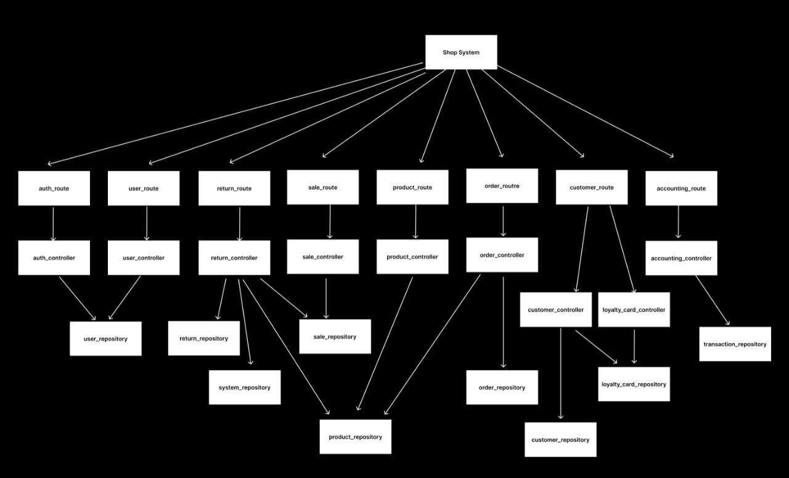
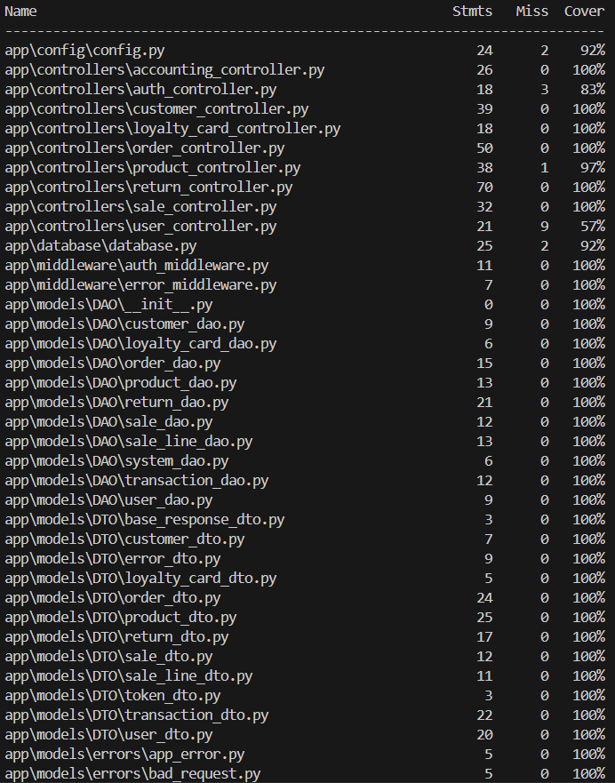
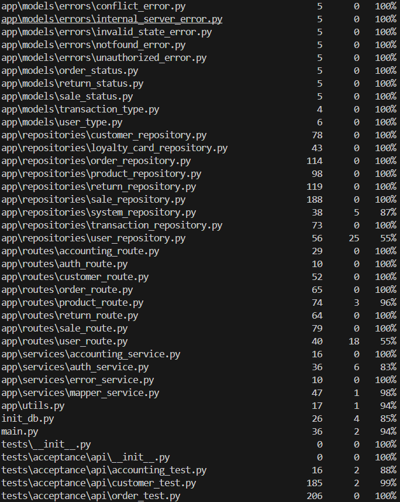
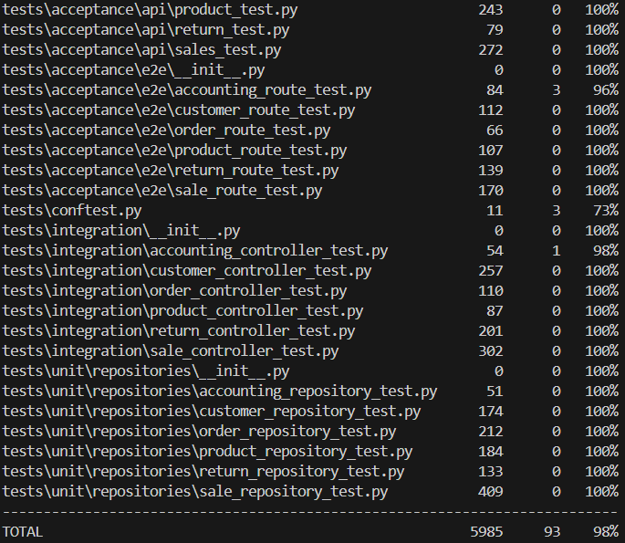

# Test Report

\<The goal of this document is to explain how the application was tested, detailing how the test cases were defined and what they cover\>

# Contents

* [Test Report](#test-report)  
* [Contents](#contents)  
* [Dependency graph](#dependency-graph)  
* [Integration approach](#integration-approach)  
* [Tests](#tests)  
* [Coverage](#coverage)  
  * [Coverage of FR](#coverage-of-fr)  
  * [Coverage white box](#coverage-white-box)

# Dependency graph

# Integration approach

    The integration sequence adopted was a bottom up:

    step1: all the repositories

    step2: all the controllers + repositories

    step3: all the routes + controllers + repositories

# Tests

 **Product API Tests**

| Test case name | Object(s) tested | Test level | Technique used |
| :---: | :---: | :---: | :---: |
| test\_create\_product\_e2e | POST /api/v1/products | API | BB / Equivalence Partitioning |
| test\_create\_product\_minimal\_e2e | POST /api/v1/products | API | BB / Equivalence Partitioning |
| test\_get\_product\_by\_id\_e2e | GET /api/v1/products/{id} | API | BB / Equivalence Partitioning |
| test\_get\_product\_by\_barcode\_e2e | GET /api/v1/products/barcode/{barcode} | API | BB / Equivalence Partitioning |
| test\_get\_all\_products\_e2e | GET /api/v1/products | API | BB / Equivalence Partitioning |
| test\_search\_products\_e2e | GET /api/v1/products?description={query} | API | BB / Equivalence Partitioning |
| test\_update\_product\_e2e | PUT /api/v1/products/{id} | API | WB / Statement Coverage |
| test\_update\_quantity\_e2e | PATCH /api/v1/products/{id}/quantity | API | WB / Statement Coverage |
| test\_update\_position\_e2e | PATCH /api/v1/products/{id}/position | API | WB / Statement Coverage |
| test\_delete\_product\_e2e | DELETE /api/v1/products/{id} | API | WB / Statement Coverage |
| test\_create\_product\_unauthorized\_e2e | POST /api/v1/products | API | BB / Error Guessing |
| test\_create\_duplicate\_barcode\_e2e | POST /api/v1/products | API | BB / Boundary Value |
| test\_invalid\_position\_format\_e2e | POST /api/v1/products | API | BB / Boundary Value |

 **Product Integration Tests**

| Test case name | Object(s) tested | Test level | Technique used |
| :---: | :---: | :---: | :---: |
| test\_product\_bottom\_up\_crud\_flow | ProductController | Integration | BB / Output Validation |
| test\_product\_bottom\_up\_not\_found\_paths | ProductController | Integration | BB / Error Guessing |
| test\_product\_bottom\_up\_duplicate\_barcode\_conflict | ProductController | Integration | BB / Boundary Value |
| test\_product\_bottom\_up\_update\_barcode\_conflict | ProductController | Integration | BB / Boundary Value |
| test\_product\_bottom\_up\_position\_format\_validation | ProductController | Integration | BB / Input Validation |
| test\_product\_bottom\_up\_position\_uniqueness\_conflict | ProductController | Integration | BB / Boundary Value |
| test\_product\_bottom\_up\_update\_quantity\_cannot\_go\_negative | ProductController | Integration | BB / Boundary Value |
| test\_product\_put\_update\_rejects\_position\_field | ProductController | Integration | BB / Input Validation |
| test\_product\_bottom\_up\_crud\_flow | ProductController | Integration | BB / Output Validation |
| test\_product\_bottom\_up\_not\_found\_paths | ProductController | Integration | BB / Error Guessing |
| test\_product\_bottom\_up\_duplicate\_barcode\_conflict | ProductController | Integration | BB / Boundary Value |
| test\_product\_bottom\_up\_update\_barcode\_conflict | ProductController | Integration | BB / Boundary Value |
| test\_product\_bottom\_up\_position\_format\_validation | ProductController | Integration | BB / Input Validation |

   
**Product Unit Tests**

| Test case name | Object(s) tested | Test level | Technique used |
| :---: | :---: | :---: | :---: |
| test\_create\_product\_success | ProductRepository | Unit | WB / Statement Coverage |
| test\_create\_product\_minimal | ProductRepository | Unit | WB / Statement Coverage |
| test\_create\_product\_duplicate\_barcode | ProductRepository | Unit | BB / Error Guessing |
| test\_get\_product\_by\_id\_success | ProductRepository | Unit | WB / Statement Coverage |
| test\_get\_product\_by\_id\_not\_found | ProductRepository | Unit | BB / Error Guessing |
| test\_get\_product\_by\_barcode\_success | ProductRepository | Unit | WB / Statement Coverage |
| test\_get\_product\_by\_barcode\_not\_found | ProductRepository | Unit | BB / Error Guessing |
| test\_get\_all\_products\_empty | ProductRepository | Unit | BB / Boundary Value |
| test\_get\_all\_products\_success | ProductRepository | Unit | WB / Statement Coverage |
| test\_search\_products\_by\_description\_found | ProductRepository | Unit | BB / Equivalence Partitioning |
| test\_search\_products\_by\_description\_not\_found | ProductRepository | Unit | BB / Boundary Value |
| test\_search\_products\_case\_insensitive | ProductRepository | Unit | BB / Equivalence Partitioning |
| test\_update\_product\_all\_fields | ProductRepository | Unit | WB / Statement Coverage |

**Order API Tests**

| Test case name | Object(s) tested | Test level | Technique used |
| :---: | :---: | :---: | :---: |
| test\_create\_and\_pay\_order\_e2e | POST /api/v1/orders/payfor | API | BB / Equivalence Partitioning |
| test\_create\_and\_pay\_order\_insufficient\_balance\_e2e | POST /api/v1/orders/payfor | API | BB / Boundary Value |
| test\_delete\_order\_not\_found\_e2e | DELETE /api/v1/orders/{id} | API | BB / Error Guessing |
| test\_pay\_reorder\_warning\_not\_found\_e2e | PATCH /api/v1/orders/{id}/pay-reorder | API | BB / Error Guessing |
| test\_issue\_reorder\_warning\_missing\_product\_e2e | POST /api/v1/orders/reorder | API | BB / Error Guessing |
| test\_create\_and\_pay\_order\_e2e | POST /api/v1/orders/payfor | API | BB / Equivalence Partitioning |
| test\_create\_and\_pay\_order\_insufficient\_balance\_e2e | POST /api/v1/orders/payfor | API | BB / Boundary Value |
| test\_delete\_order\_not\_found\_e2e | DELETE /api/v1/orders/{id} | API | BB / Error Guessing |
| test\_pay\_reorder\_warning\_not\_found\_e2e | PATCH /api/v1/orders/{id}/pay-reorder | API | BB / Error Guessing |
| test\_issue\_reorder\_warning\_missing\_product\_e2e | POST /api/v1/orders/reorder | API | BB / Error Guessing |
| test\_create\_and\_pay\_order\_e2e | POST /api/v1/orders/payfor | API | BB / Equivalence Partitioning |
| test\_create\_and\_pay\_order\_insufficient\_balance\_e2e | POST /api/v1/orders/payfor | API | BB / Boundary Value |
| test\_delete\_order\_not\_found\_e2e | DELETE /api/v1/orders/{id} | API | BB / Error Guessing |

**Order Integration Tests**

| Test case name | Object(s) tested | Test level | Technique used |
| :---: | :---: | :---: | :---: |
| test\_order\_bottom\_up\_create\_pay\_arrive\_flow | OrderController | Integration | BB / Output Validation |
| test\_order\_bottom\_up\_delete\_then\_not\_found | OrderController | Integration | BB / State Transition |
| test\_order\_bottom\_up\_not\_found\_paths | OrderController | Integration | BB / Error Guessing |
| test\_order\_bottom\_up\_create\_order\_missing\_product | OrderController | Integration | BB / Error Guessing |
| test\_order\_bottom\_up\_pay\_requires\_sufficient\_balance | OrderController | Integration | BB / Boundary Value |
| test\_order\_bottom\_up\_pay\_invalid\_state\_cannot\_pay\_twice | OrderController | Integration | BB / State Transition |
| test\_order\_bottom\_up\_arrival\_invalid\_state\_requires\_paid | OrderController | Integration | BB / State Transition |
| test\_order\_bottom\_up\_arrival\_requires\_product\_position | OrderController | Integration | BB / Boundary Value |
| test\_order\_bottom\_up\_create\_pay\_arrive\_flow | OrderController | Integration | BB / Output Validation |
| test\_order\_bottom\_up\_delete\_then\_not\_found | OrderController | Integration | BB / State Transition |
| test\_order\_bottom\_up\_not\_found\_paths | OrderController | Integration | BB / Error Guessing |
| test\_order\_bottom\_up\_create\_order\_missing\_product | OrderController | Integration | BB / Error Guessing |
| test\_order\_bottom\_up\_pay\_requires\_sufficient\_balance | OrderController | Integration | BB / Boundary Value |

**Order Unit Tests**

| Test case name | Object(s) tested | Test level | Technique used |
| :---: | :---: | :---: | :---: |
| test\_create\_order\_success | OrderRepository | Unit | WB / Statement Coverage |
| test\_get\_order\_success | OrderRepository | Unit | WB / Statement Coverage |
| test\_get\_order\_not\_found | OrderRepository | Unit | BB / Error Guessing |
| test\_get\_all\_orders\_empty | OrderRepository | Unit | BB / Boundary Value |
| test\_get\_all\_orders\_success | OrderRepository | Unit | WB / Statement Coverage |
| test\_pay\_order\_success | OrderRepository | Unit | WB / Statement Coverage |
| test\_pay\_order\_not\_found | OrderRepository | Unit | BB / Error Guessing |
| test\_pay\_order\_wrong\_status | OrderRepository | Unit | BB / State Transition |
| test\_pay\_order\_insufficient\_balance | OrderRepository | Unit | BB / Boundary Value |
| test\_record\_order\_arrival\_success | OrderRepository | Unit | WB / Statement Coverage |
| test\_record\_arrival\_not\_found | OrderRepository | Unit | BB / Error Guessing |
| test\_record\_arrival\_wrong\_status | OrderRepository | Unit | BB / State Transition |
| test\_create\_order\_success | OrderRepository | Unit | WB / Statement Coverage |

**Customer API Tests**

| Test case name | Object(s) tested | Test level | Technique used |
| :---: | :---: | :---: | :---: |
| test\_create\_customer\_success | POST /customers | API  | BB/ eq partitioning |
| test\_create\_customer\_bad\_request | POST /customers | API  | BB/ eq partitioning |
| test\_get\_all\_customers\_success | GET /customers | API  | BB/ eq partitioning |
| test\_get\_customer\_success | GET /customers/{customer\_id} | API | BB/ eq partitioning |
| test\_get\_customer\_invalid\_id | GET /customers/{customer\_id} | API | BB/ eq partitioning |
| test\_get\_customer\_not\_found | GET /customers/{customer\_id} | API | BB/ eq partitioning |
| test\_update\_customer\_success | PUT /customers/{customer\_id} | API | BB/ eq partitioning |
| test\_update\_customer\_invalid\_id | PUT /customers/{customer\_id} | API | BB/ eq partitioning |
| test\_update\_customer\_invalid\_payload | PUT /customers/{customer\_id} | API | BB/ eq partitioning |
| test\_update\_customer\_not\_found | PUT /customers/{customer\_id} | API | BB/ eq partitioning |
| test\_create\_loyalty\_card\_success | POST /customers/cards | API | BB/ eq partitioning |
| test\_attach\_loyalty\_card\_to\_customer\_success | PATCH /customers/{customer\_id}/attach-card/{card\_id} | API | BB/ eq partitioning |
| test\_attach\_card\_not\_found\_error | PATCH /customers/{customer\_id}/attach-card/{card\_id} | API | BB/ eq partitioning |
| test\_attach\_card\_conflict\_error | PATCH /customers/{customer\_id}/attach-card/{card\_id} | API | BB/ eq partitioning |
| test\_update\_loyalty\_card\_points\_success | PATCH /customers/cards/{card\_id}?points={points} | API | BB/ eq partitioning |
| test\_delete\_customer\_success | DELETE /customers/{customer\_id} | API | BB/ eq partitioning |
| test\_delete\_customer\_not\_found | DELETE /customers/{customer\_id} | API | BB/ eq partitioning |

**Customer Integration Tests**

| Test case name | Object(s) tested | Test level | Technique used |
| :---: | :---: | :---: | :---: |
| test\_create\_customer\_without\_card | CustomerController.create\_customer() | Integration | BB/ eq partitioning |
| test\_create\_loyalty\_card | LoyaltyCardController.create\_loyalty\_card() | Integration | BB/ eq partitioning |
| test\_create\_customer\_with\_card | CustomerController.create\_customer() | Integration | BB/ eq partitioning |
| test\_get\_customer | CustomerController.get\_customer() | Integration | BB/ eq partitioning |
| test\_get\_customer\_not\_found | CustomerController.get\_customer() | Integration | BB/ eq partitioning |
| test\_get\_loyalty\_card | LoyaltyCardController.get\_loyalty\_card() | Integration | BB/ eq partitioning |
| test\_get\_loyalty\_card\_not\_found | LoyaltyCardController.get\_loyalty\_card() | Integration | BB/ eq partitioning |
| test\_list\_customers | CustomerController.list\_customers() | Integration | BB/ eq partitioning |
| test\_list\_customers\_empty | CustomerController.list\_customers() | Integration | BB/ eq partitioning |
| test\_update\_loyalty\_card\_points | LoyaltyCardController.update\_loyalty\_card\_points() | Integration | BB/ eq partitioning |
| test\_update\_loyalty\_card\_points\_not\_found | LoyaltyCardController.update\_loyalty\_card\_points() | Integration | BB/ eq partitioning |
| test\_update\_customer\_name\_and\_card\_fixed | CustomerController.update\_customer() | Integration | BB/ eq partitioning |
| test\_update\_customer\_name\_and\_card\_customer\_not\_found | CustomerController.update\_customer() | Integration | BB/ eq partitioning |
| test\_update\_customer\_delte\_card | CustomerController.update\_customer() | Integration | BB/ eq partitioning |
| test\_attach\_loyalty\_card\_to\_customer | CustomerController.attach\_loyalty\_card\_to\_customer() | Integration | BB/ eq partitioning |
| test\_attach\_loyalty\_card\_to\_customer\_customer\_not\_found | CustomerController.attach\_loyalty\_card\_to\_customer() | Integration | BB/ eq partitioning |
| test\_delete\_customer | CustomerController.delete\_customer() | Integration | BB/ eq partitioning |
| test\_delete\_customer\_not\_found | CustomerController.delete\_customer() | Integration | BB/ eq partitioning |
| test\_delete\_loyalty\_card | LoyaltyCardController.delete\_loyalty\_card() | Integration | BB/ eq partitioning |
| test\_delete\_loyalty\_card\_not\_found | LoyaltyCardController.delete\_loyalty\_card() | Integration | BB/ eq partitioning |

**Customer Unit Tests**

| Test case name | Object(s) tested | Test level | Technique used |
| :---: | :---: | :---: | :---: |
| test\_create\_customer\_success | CustomerRepository.create\_customer() | Unit | BB/ eq partitioning |
| test\_create\_loyalty\_card\_success | LoyaltyCardRepository.create\_loyalty\_card() | Unit  | BB/ eq partitioning |
| test\_create\_customer\_conflict | CustomerRepository.create\_customer() | Unit  | BB/ eq partitioning |
| test\_get\_customer\_success | CustomerRepository.get\_customer() | Unit  | BB/ eq partitioning |
| test\_get\_loyalty\_card\_success | LoyaltyCardRepository.get\_loyalty\_card() | Unit  | BB/ eq partitioning |
| test\_get\_customer\_not\_found | CustomerRepository.get\_customer() | Unit  | BB/ eq partitioning |
| test\_get\_loyalty\_card\_not\_found | LoyaltyCardRepository.get\_loyalty\_card() | Unit  | BB/ eq partitioning |
| test\_list\_customers\_empty | CustomerRepository.list\_customers() | Unit  | BB/ eq partitioning |
| test\_list\_customers\_success | CustomerRepository.list\_customers() | Unit  | BB/ eq partitioning |
| test\_update\_loyalty\_card\_points\_success | LoyaltyCardRepository.update\_loyalty\_card\_points() | Unit  | BB/ eq partitioning |
| test\_update\_loyalty\_card\_points\_not\_enough\_points | LoyaltyCardRepository.update\_loyalty\_card\_points() | Unit  | BB/ eq partitioning |
| test\_update\_loyalty\_card\_points\_not\_found | LoyaltyCardRepository.update\_loyalty\_card\_points() | Unit  | BB/ eq partitioning |
| test\_update\_customer\_card\_success | CustomerRepository.update\_customer\_card() | Unit  | BB/ eq partitioning |
| test\_update\_customer\_card\_customer\_not\_found | CustomerRepository.update\_customer\_card() | Unit  | BB/ eq partitioning |
| test\_update\_customer\_card\_loyalty\_card\_not\_found | CustomerRepository.update\_customer\_card() | Unit  | BB/ eq partitioning |
| test\_update\_customer\_card\_already\_attached\_to\_him | CustomerRepository.update\_customer\_card() | Unit  | BB/ eq partitioning |
| test\_update\_customer\_card\_already\_attached\_to\_other | CustomerRepository.update\_customer\_card() | Unit  | BB/ eq partitioning |
| test\_update\_customer\_only\_name\_success | CustomerRepository.update\_customer() | Unit  | BB/ eq partitioning |
| test\_update\_customer\_only\_name\_not\_found | CustomerRepository.update\_customer() | Unit  | BB/ eq partitioning |
| test\_update\_customer\_only\_name\_conflict\_on\_name | CustomerRepository.update\_customer() | Unit  | BB/ eq partitioning |
| test\_update\_customer\_only\_card\_success | CustomerRepository.update\_customer() | Unit  | BB/ eq partitioning |
| test\_update\_customer\_detach\_card\_success | CustomerRepository.update\_customer() | Unit  | BB/ eq partitioning |
| test\_delete\_customer\_success | CustomerRepository.delete\_customer() | Unit  | BB/ eq partitioning |
| test\_delete\_loyalty\_card\_success | LoyaltyCardRepository.delete\_loyalty\_card() | Unit  | BB/ eq partitioning |
| test\_delete\_customer\_not\_found | CustomerRepository.delete\_customer() | Unit  | BB/ eq partitioning |
| test\_delete\_loyalty\_card\_not\_found | LoyaltyCardRepository.delete\_loyalty\_card() | Unit | BB/ eq partitioning |

**Return API Tests**

| Test case name | Object(s) tested | Test level | Technique used |
| :---- | :---- | :---- | :---- |
| test\_start\_return\_route | POST /api/v1/returns/ | API | BB / Equivalence Partitioning |
| test\_start\_return\_route\_sale\_not\_found | POST /api/v1/returns/ | API | BB / Error Guessing |
| test\_get\_all\_returns\_route | GET /api/v1/returns/ | API | BB / Equivalence Partitioning |
| test\_get\_all\_returns\_by\_sale\_route | GET /api/v1/returns/sale/{id} | API | BB / Equivalence Partitioning |
| test\_get\_return\_route | GET /api/v1/returns/{id} | API | BB / Equivalence Partitioning |
| test\_get\_return\_route\_not\_found | GET /api/v1/returns/{id} | API | BB / Error Guessing |
| test\_add\_product\_to\_return\_route | POST /api/v1/returns/{id}/items | API | BB / Equivalence Partitioning |
| test\_add\_product\_to\_return\_route\_not\_found | POST /api/v1/returns/{id}/items | API | BB / Error Guessing |
| test\_delete\_product\_from\_return\_route | DELETE /api/v1/returns/{id}/items | API | BB / Equivalence Partitioning |
| test\_delete\_product\_from\_return\_route\_not\_found | DELETE /api/v1/returns/{id}/items | API | BB / Error Guessing |
| test\_close\_return\_route | PATCH /api/v1/returns/{id}/close | API | BB / State Transition |
| test\_close\_return\_route\_not\_found | PATCH /api/v1/returns/{id}/close | API | BB / Error Guessing |
| test\_reimburse\_return\_route | PATCH /api/v1/returns/{id}/reimburse | API | BB / State Transition |
| test\_reimburse\_return\_route\_not\_found | PATCH /api/v1/returns/{id}/reimburse | API | BB / Error Guessing |
| test\_delete\_return\_route | DELETE /api/v1/returns/{id} | API | BB / Equivalence Partitioning |
| test\_delete\_return\_route\_not\_found | DELETE /api/v1/returns/{id} | API | BB / Error Guessing |

**Return Integration Tests**

| Test case name | Object(s) tested | Test level | Technique used |
| :---- | :---- | :---- | :---- |
| test\_start\_return | ReturnController.start\_return | Integration | BB / Output Validation |
| test\_get\_return\_success | ReturnController.get\_return | Integration | BB / Equivalence Partitioning |
| test\_get\_return\_not\_found | ReturnController.get\_return | Integration | BB / Error Guessing |
| test\_list\_all\_returns\_success | ReturnController.list\_returns | Integration | BB / Equivalence Partitioning |
| test\_get\_all\_returns\_by\_sale\_success | ReturnController.get\_returns\_by\_sale | Integration | BB / Equivalence Partitioning |
| test\_add\_product\_to\_return\_success | ReturnController.add\_item | Integration | BB / Output Validation |
| test\_remove\_product\_from\_return\_success | ReturnController.remove\_item | Integration | BB / Output Validation |
| test\_add\_product\_to\_return\_not\_found | ReturnController.add\_item | Integration | BB / Error Guessing |
| test\_remove\_product\_from\_return\_not\_found | ReturnController.remove\_item | Integration | BB / Error Guessing |
| test\_add\_product\_to\_return\_invalid\_state | ReturnController.add\_item | Integration | BB / State Transition |
| test\_remove\_product\_from\_return\_invalid\_state | ReturnController.remove\_item | Integration | BB / State Transition |
| test\_close\_return\_success | ReturnController.close\_return | Integration | BB / State Transition |
| test\_close\_return\_fail\_if\_not\_open | ReturnController.close\_return | Integration | BB / State Transition |
| test\_close\_return\_not\_found | ReturnController.close\_return | Integration | BB / Error Guessing |
| test\_close\_empty\_return\_with\_deletion | ReturnController.close\_return | Integration | BB / Boundary Value Analysis |
| test\_reimburse\_return\_success | ReturnController.reimburse\_return | Integration | BB / State Transition |
| test\_reimburse\_return\_not\_found | ReturnController.reimburse\_return | Integration | BB / Error Guessing |
| test\_reimburse\_return\_invalid\_state | ReturnController.reimburse\_return | Integration | BB / State Transition |
| test\_delete\_return\_success | ReturnController.delete\_return | Integration | BB / Output Validation |
| test\_delete\_return\_not\_found | ReturnController.delete\_return | Integration | BB / Error Guessing |
| test\_delete\_return\_fail\_if\_reimbursed | ReturnController.delete\_return | Integration | BB / State Transition |

### 

**Return Unit Tests**

| Test case name | Object(s) tested | Test level | Technique used |
| :---- | :---- | :---- | :---- |
| test\_create\_and\_get\_returns\_also\_with\_invalid\_sale\_state | ReturnRepository.create\_return | Unit | WB / Statement Coverage |
| test\_add\_and\_remove\_line\_all\_cases | ReturnRepository.add\_line | Unit | WB / Path Coverage |
| test\_update\_status | ReturnRepository.update\_status | Unit | WB / Statement Coverage |

**Sale API Tests**

| Test case name | Object(s) tested | Test level | Technique used |
| ----- | :---: | :---: | :---: |
| test\_start\_sale\_success | POST/sales | API  | BB / eq partitioning  |
| test\_start\_sale\_unauthorized | POST/sales | API  | BB / eq partitioning |
| test\_get\_all\_sales\_success | GET/sales | API  | BB / eq partitioning |
| test\_get\_all\_sales\_empty | GET/sales | API | BB / eq partitioning |
| test\_get\_all\_sales\_unauthorized | GET/sales | API | BB / eq partitioning |
| test\_get\_sale\_success | GET/sales/{sale\_id} | API | BB / eq partitioning |
| test\_get\_sale\_invalid\_id | GET/sales/{sale\_id} | API | BB / boundary |
| test\_delete\_sale\_success | DELETE/sales/{sale\_id} | API | BB / eq partitioning |
| test\_delete\_sale\_invalid\_id | DELETE/sales/{sale\_id} | API | BB / boundary |
| test\_add\_product\_success | POST/sales/{sale\_id}/items | API | BB / eq partitioning |
| test\_add\_product\_invalid\_sale\_id | POST/sales/{sale\_id}/items | API | BB / boundary |
| test\_add\_product\_invalid\_amount | POST/sales/{sale\_id}/items | API | BB / boundary |
| test\_remove\_product\_success | DELETE/sales/{sale\_id}/items | API | BB / eq partitioning |
| test\_remove\_product\_invalid\_sale\_id | DELETE/sales/{sale\_id}/items | API | BB / boundary |
| test\_remove\_product\_invalid\_amount | DELETE/sales/{sale\_id}/items | API | BB / boundary |
| test\_apply\_discount\_success | PATCH/sales/{sale\_id}/discount | API | BB / eq partitioning |
| test\_apply\_discount\_invalid\_rate | PATCH/sales/{sale\_id}/discount | API | BB / boundary |
| test\_apply\_product\_discount\_success | PATCH/sales/{sale\_id}/items/{product\_barcode}/discount | API | BB / eq partitioning |
| test\_apply\_product\_discount\_invalid\_rate | PATCH/sales/{sale\_id}/items/{product\_barcode}/discount | API | BB / boundary |
| test\_apply\_product\_discount\_invalid\_sale\_id | PATCH/sales/{sale\_id}/items/{product\_barcode}/discount | API | BB / boundary |
| test\_close\_sale\_success | PATCH/sales/{sale\_id}/close | API | BB / eq partitioning |
| test\_close\_sale\_invalid\_id | PATCH/sales/{sale\_id}/close | API | BB / boundary |
| test\_close\_sale\_unauthorized | PATCH/sales/{sale\_id}/close | API | BB / eq partitioning |
| test\_pay\_sale\_success | PATCH/sales/{sale\_id}/pay | API | BB / eq partitioning |
| test\_pay\_sale\_invalid\_cash | PATCH/sales/{sale\_id}/pay | API | BB / boundary |
| test\_get\_sale\_points\_success | GET/sales/{sale\_id}/points | API | BB / eq partitioning |
| test\_get\_sale\_points\_invalid\_id | GET/sales/{sale\_id}/points | API | BB / boundary |

**Sale Integration Tests**

| Test case name | Object(s) tested | Test level | Technique used |
| ----- | :---: | :---: | :---: |
| test\_start\_sale\_success | SaleController.start\_sale() | Integration | BB / eq partitioning |
| test\_list\_sales\_success | SaleController.list\_sales() | Integration | BB / eq partitioning |
| test\_get\_sale\_success | SaleController.get\_sale() | Integration | BB / eq partitioning |
| test\_get\_sale\_not\_found | SaleController.get\_sale() | Integration | BB / eq partitioning |
| test\_delete\_sale\_success | SaleController.delete\_sale() | Integration | BB / eq partitioning |
| test\_delete\_sale\_not\_found | SaleController.delete\_sale() | Integration | BB / eq partitioning |
| test\_add\_product\_success | SaleController.add\_product\_to\_sale() | Integration | BB / eq partitioning |
| test\_add\_product\_bad\_amount | SaleController.add\_product\_to\_sale() | Integration | BB / boundary |
| test\_add\_product\_insufficient\_stock | SaleController.add\_product\_to\_sale() | Integration | BB / eq partitioning |
| test\_remove\_product\_success | SaleController.remove\_product\_from\_sale() | Integration | BB / eq partitioning |
| test\_remove\_product\_bad\_amount | SaleController.remove\_product\_from\_sale() | Integration | BB / boundary |
| test\_remove\_product\_too\_many | SaleController.remove\_product\_from\_sale() | Integration | BB / eq partitioning |
| test\_discount\_sale\_success | SaleController.apply\_discount() | Integration | BB / eq partitioning |
| test\_discount\_sale\_bad\_rate | SaleController.apply\_discount() | Integration | BB / boundary |
| test\_discount\_sale\_not\_open | SaleController.apply\_discount() | Integration | BB / state transition |
| test\_discount\_product\_success | SaleController.apply\_product\_discount() | Integration | BB / eq partitioning |
| test\_discount\_product\_bad\_rate | SaleController.apply\_product\_discount() | Integration | BB / boundary |
| test\_close\_success\_sets\_pending\_and\_closed\_at | SaleController.close\_sale() | Integration | BB / state transition |
| test\_close\_empty\_sale\_deletes\_it | SaleController.close\_sale() | Integration | BB / eq partitioning |
| test\_pay\_success | SaleController.pay\_sale() | Integration | BB / eq partitioning |
| test\_pay\_bad\_cash\_amount | SaleController.pay\_sale() | Integration | BB / boundary |
| test\_pay\_not\_pending | SaleController.pay\_sale() | Integration | BB / state transition |
| test\_points\_success | SaleController.get\_sale\_points() | Integration | BB / eq partitioning |
| test\_points\_not\_paid | SaleController.get\_sale\_points() | Integration | BB / state transition |

**Sale Unit Tests**

| Test case name | Object(s) tested | Test level | Technique used |
| ----- | :---: | :---: | :---: |
| test\_sale\_repo\_create\_sale\_success | SaleRepository.create\_sale() | Unit | BB / eq partitioning |
| test\_sale\_repo\_list\_sales\_returns\_list | SaleRepository.list\_sales() | Unit | BB / eq partitioning |
| test\_sale\_repo\_get\_sale\_not\_found | SaleRepository.get\_sale() | Unit | BB / eq partitioning |
| test\_sale\_repo\_get\_sale\_pending\_no\_lines\_is\_considered\_cancelled | SaleRepository.get\_sale() | Unit | WB / statement |
| test\_sale\_repo\_delete\_sale\_not\_found | SaleRepository.delete\_sale() | Unit | BB / eq partitioning |
| test\_sale\_repo\_delete\_paid\_sale\_conflict | SaleRepository.delete\_sale() | Unit | BB / state transition |
| test\_sale\_repo\_delete\_sale\_restores\_stock\_quantities | SaleRepository.delete\_sale() | Unit | BB / eq partitioning |
| test\_sale\_repo\_add\_product\_bad\_amount | SaleRepository.add\_product\_to\_sale() | Unit | BB / boundary |
| test\_sale\_repo\_add\_product\_sale\_not\_found | SaleRepository.add\_product\_to\_sale() | Unit | BB / eq partitioning |
| test\_sale\_repo\_add\_product\_wrong\_status | SaleRepository.add\_product\_to\_sale() | Unit | BB / state transition |
| test\_sale\_repo\_add\_product\_product\_not\_found | SaleRepository.add\_product\_to\_sale() | Unit | BB / eq partitioning |
| test\_sale\_repo\_add\_product\_insufficient\_stock\_conflict | SaleRepository.add\_product\_to\_sale() | Unit | BB / eq partitioning |
| test\_sale\_repo\_add\_product\_success\_decreases\_stock\_and\_creates\_line | SaleRepository.add\_product\_to\_sale() | Unit | BB / eq partitioning |
| test\_sale\_repo\_remove\_product\_bad\_amount | SaleRepository.remove\_product\_from\_sale() | Unit | BB / boundary |
| test\_sale\_repo\_remove\_product\_sale\_not\_found | SaleRepository.remove\_product\_from\_sale() | Unit | BB / eq partitioning |
| test\_sale\_repo\_remove\_product\_wrong\_status | SaleRepository.remove\_product\_from\_sale() | Unit | BB / state transition |
| test\_sale\_repo\_remove\_product\_line\_not\_found | SaleRepository.remove\_product\_from\_sale() | Unit | BB / eq partitioning |
| test\_sale\_repo\_remove\_product\_success\_partial\_restores\_stock\_and\_decreases\_line\_qty | SaleRepository.remove\_product\_from\_sale() | Unit | BB / eq partitioning |
| test\_sale\_repo\_remove\_product\_deletes\_line\_when\_amount\_eq\_line\_qty | SaleRepository.remove\_product\_from\_sale() | Unit | BB / boundary |
| test\_sale\_repo\_remove\_product\_fails\_when\_amount\_gt\_line\_qty | SaleRepository.remove\_product\_from\_sale() | Unit | BB / eq partitioning |
| test\_sale\_repo\_apply\_discount\_invalid\_rate | SaleRepository.apply\_discount() | Unit | BB / boundary |
| test\_sale\_repo\_apply\_discount\_wrong\_status | SaleRepository.apply\_discount() | Unit | BB / state transition |
| test\_sale\_repo\_apply\_product\_discount\_line\_not\_found | SaleRepository.apply\_product\_discount() | Unit | BB / eq partitioning |
| test\_sale\_repo\_close\_sale\_wrong\_status | SaleRepository.close\_sale() | Unit | BB / state transition |
| test\_sale\_repo\_pay\_sale\_wrong\_state | SaleRepository.pay\_sale() | Unit | BB / state transition |
| test\_sale\_repo\_pay\_sale\_insufficient\_cash | SaleRepository.pay\_sale() | Unit | BB / eq partitioning |
| test\_sale\_repo\_pay\_sale\_success\_updates\_status\_and\_balance | SaleRepository.pay\_sale() | Unit | BB / eq partitioning |
| test\_sale\_repo\_get\_points\_wrong\_state | SaleRepository.get\_sale\_points() | Unit | BB / state transition |
| test\_sale\_repo\_get\_points\_success\_equals\_floor\_total | SaleRepository.get\_sale\_points() | Unit | BB / boundary |
| test\_sale\_repo\_apply\_product\_discount\_invalid\_rate\_raises | SaleRepository.apply\_product\_discount() | Unit | BB / boundary |
| test\_sale\_repo\_pay\_sale\_invalid\_cash\_amount\_raises | SaleRepository.pay\_sale() | Unit | BB / boundary |
| test\_sale\_repo\_apply\_discount\_success\_updates\_sale | SaleRepository.apply\_discount() | Unit | BB / eq partitioning |
| test\_sale\_repo\_apply\_product\_discount\_success\_updates\_line | SaleRepository.apply\_product\_discount() | Unit | BB / eq partitioning |
| test\_sale\_repo\_close\_empty\_sale\_deletes\_sale | SaleRepository.close\_sale() | Unit | BB / eq partitioning |
| test\_sale\_repo\_pay\_sale\_sets\_closed\_at\_if\_missing | SaleRepository.pay\_sale() | Unit | WB / statement |
| test\_sale\_repo\_pay\_sale\_creates\_system\_info\_if\_missing | SaleRepository.pay\_sale() | Unit | WB / statement |
| test\_sale\_repo\_apply\_product\_discount\_wrong\_status\_raises | SaleRepository.apply\_product\_discount() | Unit | BB / state transition |

**Accounting API Tests**

| Test case name | Object(s) tested | Test level | Technique used |
| ----- | :---: | :---: | :---: |
| test\_get\_balance\_success\_as\_admin | GET /api/v1/balance | API | BB / Equivalence Partitioning |
| test\_get\_balance\_forbidden\_as\_manager | GET /api/v1/balance | API | BB / Role-Based Analysis |
| test\_get\_balance\_unauthenticated | GET /api/v1/balance | API | BB / Negative Testing |
| test\_set\_balance\_success | POST /api/v1/balance/set | API | BB / Equivalence Partitioning |
| test\_set\_balance\_negative\_amount | POST /api/v1/balance/set | API | BB / Boundary Value Analysis |
| test\_reset\_balance\_success | POST /api/v1/balance/reset | API | BB / State Transition |

**Accounting Integration Tests**

| Test case name | Object(s) tested | Test level | Technique used |
| ----- | :---: | :---: | :---: |
| test\_validation\_get\_history\_invalid\_date\_range | AccountingController.get\_history | Integration | Gray Box / Error Path |
| test\_controller\_record\_transaction\_success | AccountingController.record\_transaction | Integration | Gray Box / Success Path |
| test\_controller\_get\_history\_success | AccountingController.get\_history | Integration | Gray Box / Data Flow |
| test\_accounting\_service\_coverage | AccountingService.record\_transaction | Integration | Gray Box / Component Integration |

**Accounting Unit Tests**

| Test case name | Object(s) tested | Test level | Technique used |
| ----- | :---: | :---: | :---: |
| test\_repository\_coverage\_edge\_cases | TransactionRepository (session injection) | Unit | WB / Statement Coverage |
| test\_repository\_coverage\_edge\_cases | TransactionRepository (set\_balance) | Unit | WB / Branch Coverage |
| test\_validation\_transaction\_negative\_amount | TransactionCreateDTO | Unit | WB / Boundary Value |
| test\_validation\_transaction\_zero\_amount | TransactionCreateDTO | Unit | WB / Boundary Value |

# Coverage

## Coverage of FR

| Functional Requirement or scenario | Test(s) |
| :---- | ----- |
| FR3.1 | **product_test.py:** - test_create_product_success_all_roles - test_create_product_success_as_admin - test_create_product_success_as_manager - test_create_product_minimal_fields **product_repository_test.py:** - test_create_product_success - test_create_product_minimal **product_route_test.py:** - test_update_product_success - test_update_product_not_found - test_update_product_barcode_conflict **product_repository_test.py:** - test_update_product_all_fields - test_update_product_partial - test_update_product_not_found **product_controller_test.py:** - test_update_product |
| FR3.2 | **product_route_test.py:** - test_delete_product_success - test_delete_product_not_found - test_delete_product_forbidden_as_cashier - test_delete_product_unauthenticated **product_repository_test.py:** - test_delete_product_success - test_delete_product_not_found **product_controller_test.py:** - test_delete_product |
| FR3.3 | **product_route_test.py:** - test_get_all_products_success_as_admin - test_get_all_products_success_as_manager - test_get_all_products_success_as_cashier - test_get_all_products_unauthenticated **product_repository_test.py:** - test_get_all_products_empty - test_get_all_products_success **product_controller_test.py:** - test_get_all_products |
| FR3.4 | **Search by barcode product_route_test.py:** - test_get_product_by_barcode_success - test_get_product_by_barcode_not_found - test_get_product_by_barcode_invalid_format **product_repository_test.py:** - test_get_product_by_barcode_success - test_get_product_by_barcode_not_found **product_controller_test.py:** - test_get_product_by_barcode **Search by description product_route_test.py:** - test_search_products_success - test_search_products_no_results - test_search_products_case_insensitive **product_repository_test.py:** - test_search_products_by_description_found - test_search_products_by_description_not_found - test_search_products_case_insensitive **product_controller_test.py:** - test_search_products_by_description |
| FR4.1 | **product_controller_test.py:** - test_update_quantity **product_repository_test.py:** - test_update_quantity_increase - test_update_quantity_decrease - test_update_quantity_to_zero - test_update_quantity_negative_result - test_update_quantity_not_found **product_test.py:** - test_update_quantity_e2e |
| FR4.2 | **product_controller_test.py:** - test_update_position **product_repository_test.py:** - test_update_position_valid_format - test_update_position_various_formats - test_update_position_invalid_forma - test_update_position_clear - test_update_position_not_found **product_test.py:** - test_update_position_e2e |
| FR4.3 | **order_repository_test.py:** - test_issue_reorder_warning_success **order_controller.py:** - issue_reorder_warning **order_repository.py:** - issue_reorder_warning **order_route.py (API):** - POST /orders/reorder |
| FR4.4 | **order_route_test.py:** - test_create_order_success_as_admin - test_create_order_success_as_manager - test_create_order_invalid_product - test_create_order_missing_fields - test_create_order_invalid_quantity - test_create_order_unauthenticated - test_create_order_forbidden_as_cashier - test_pay_order_success - test_pay_order_wrong_status - test_pay_order_not_found - test_payfor_order_success_as_admin - test_payfor_order_success_as_manager - test_payfor_order_forbidden_as_cashier - test_payfor_order_unauthenticated **order_repository_test.py:** - test_create_order_success - test_pay_order_success - test_pay_order_wrong_status - test_pay_order_insufficient_balance **order_controller_test.py:** - test_create_order - test_pay_order - test_create_and_pay_order **order_test.py:** - test_create_and_pay_order_e2e - test_create_and_pay_order_insufficient_balance_e2e |
| FR4.5 | **order_repository_test.py:** - test_pay_reorder_warning_success - test_pay_reorder_warning_not_found - test_pay_reorder_warning_not_a_reorder - test_pay_reorder_warning_already_paid - test_pay_reorder_warning_insufficient_balance **order_controller.py:** - pay_reorder_warning **order_repository.py:** - pay_reorder_warning **order_route.py (API):** - PATCH /orders/{order_id}/pay-reorder |
| FR4.6 | **order_route_test.py:** - test_record_arrival_success - test_record_arrival_wrong_status - test_record_arrival_not_found - test_record_arrival_product_without_position **order_repository_test.py:** - test_record_order_arrival_success - test_record_arrival_wrong_status - test_record_arrival_no_position - test_record_arrival_orphaned_order **order_controller_test.py:** - test_record_order_arrival |
| FR4.7 | **order_route_test.py:** - test_get_all_orders_success_as_admin - test_get_all_orders_success_as_manager - test_get_all_orders_forbidden_as_cashier - test_get_all_orders_unauthenticated **order_repository_test.py:** - test_get_all_orders_empty - test_get_all_orders_success **order_controller_test.py:** - test_get_all_orders |
| FR5.1 | **customer_test.py:** - test_create_customer_success_as_admin - test_create_customer_success_as_manager - test_create_customer_success_as_cashier - test_create_customer_conflict - test_create_customer_missing_fields - test_create_customer_unauthenticated - test_update_customer_name_but_not_card_success - test_update_customer_card_but_not_name_success - test_update_customer_deletion_card_success - test_update_customer_not_found - test_update_customer_card_not_found - test_update_customer_name_conflict - test_update_customer_unauthenticated **cusotmer_route_test.py:** - test_create_customer_success - test_create_customer_bad_request - test_update_customer_success - test_update_customer_invalid_id - test_update_customer_invalid_payload - test_update_customer_not_found **customer_controller_test.py:** - test_create_customer_without_card - test_create_customer_with_card - test_update_customer_name_and_card - test_update_customer_name_and_card_customer_not_found **customer_repository_test.py:** - test_create_customer_success - test_create_customer_conflict - test_update_customer_card_success - test_update_customer_card_customer_not_found - test_update_customer_card_loyalty_card_not_found - test_update_customer_card_already_attached_to_him - test_update_customer_card_already_attached_to_other - test_update_customer_only_name_success - test_update_customer_only_name_not_found - test_update_customer_only_name_conflict_on_name - test_update_customer_only_card_success - test_update_customer_detach_card_success |
| FR5.2 | **customer_test.py:** - test_delete_customer_success - test_delete_customer_unauthenticated - test_delete_customer_not_found **customer_route_test.py:** - test_delete_customer_success - test_delete_customer_not_found **customer_controller_test.py:** - test_delete_customer - test_delete_customer_not_found **customer_repository_test.py:** - test_delete_customer_success - test_delete_customer_not_found |
| FR5.3 | **customer_test.py:** - test_get_customer_success - test_get_customer_not_found - test_get_customer_unauthenticated **customer_route_test.py:** - test_get_customer_success - test_get_customer_invalid_id - test_get_customer_not_found **customer_controller_test.py:** - test_get_customer - test_get_customer_not_found **customer_repository_test.py:** - test_get_customer_success - test_get_customer_not_found |
| FR5.4 | **customer_test.py:** - test_list_customers_success_as_admin - test_list_customers_success_as_manager - test_list_customers_success_as_cashier - test_list_customers_unauthenticated **customer_route_test.py:** - test_get_all_customers_success **customer_controller_test.py:** - test_list_customers - test_list_customers_empty **customer_repository_test.py:** - test_list_customers_success - test_list_customers_empty |
| FR5.5 | **customer_test.py:** - test_create_loyalty_card_success_as_admin - test_create_loyalty_card_success_as_manager - test_create_loyalty_card_success_as_cashier - test_create_loyalty_card_unauthenticated **customer_route_test.py:** - test_create_loyalty_card_success **customer_controller_test.py:** - test_create_loyalty_card **customer_repository_test.py:** - test_create_loyalty_card_success |
| FR5.6 | **customer_test.py:** - test_attach_loyalty_card_to_customer_success - test_attach_loyalty_card_to_customer_customer_not_found - test_attach_loyalty_card_to_customer_card_not_found - test_attach_loyalty_card_to_customer_already_attached_to_this_customer - test_attach_loyalty_card_to_customer_already_attached_to_other_customer - test_attach_loyalty_card_to_customer_unauthenitcated **customer_route_test.py:** - test_attach_loyalty_card_to_customer_success - test_attach_card_not_found_error - test_attach_card_conflict_error **customer_controller_test.py:** - test_attach_loyalty_card_to_customer - test_attach_loyalty_card_to_customer_customer_not_found |
| FR5.7 | **customer_test.py:** - test_update_loyalty_card_points_success - test_update_loyalty_card_points_card_not_found - test_update_loyalty_card_points_unauthenticated **customer_route_test.py:** - test_update_loyalty_card_points_success **customer_controller_test.py:** - test_update_loyalty_card_points - test_update_loyalty_card_points_not_found **customer_repository_test.py:** - test_update_loyalty_card_points_success - test_update_loyalty_card_points_not_enough_points - test_update_loyalty_card_points_not_found |
| FR6.1 | **sales_test.py:** - test_start_sale_success_as_admin - test_start_sale_success_as_cashier - test_start_sale_unauthenticated **sale_route_test.py:** - test_start_sale_success - test_start_sale_unauthorized **sale_controller_test.py:** - test_start_sale_success **sale_repository_test.py:** - test_sale_repo_create_sale_success |
| FR6.2 | **sales_test.py:** - test_add_item_to_sale_success - test_add_item_invalid_amount - test_add_item_sale_not_found - test_add_item_invalid_status - test_add_item_unauthenticated **sale_route_test.py:** - test_add_product_success - test_add_product_invalid_sale_id - test_add_product_invalid_amount **sale_controller_test.py:** - test_add_product_success - test_add_product_bad_amount - test_add_product_insufficient_stock **sale_repository_test.py:** - test_sale_repo_add_product_success_decreases_stock_and_creates_line - test_sale_repo_add_product_bad_amount - test_sale_repo_add_product_sale_not_found - test_sale_repo_add_product_wrong_status - test_sale_repo_add_product_product_not_found - test_sale_repo_add_product_insufficient_stock_conflict |
| FR6.3 | **sales_test.py:** - test_remove_item_from_sale_success - test_remove_item_invalid_amount - test_remove_item_sale_not_found - test_remove_item_invalid_status - test_remove_item_not_in_sale - test_remove_item_unauthenticated **sale_route_test.py:** - test_remove_product_success - test_remove_product_invalid_sale_id - test_remove_product_invalid_amount **sale_controller_test.py:** - test_remove_product_success - test_remove_product_bad_amount - test_remove_product_too_many **sale_repository_test.py:** - test_sale_repo_remove_product_success_partial_restores_stock_and_decreases_line_qty - test_sale_repo_remove_product_deletes_line_when_amount_eq_line_qty - test_sale_repo_remove_product_fails_when_amount_gt_line_qty - test_sale_repo_remove_product_bad_amount - test_sale_repo_remove_product_sale_not_found - test_sale_repo_remove_product_wrong_status - test_sale_repo_remove_product_line_not_found |
| FR6.4 | **sales_test.py:** - test_apply_discount_to_sale_success - test_apply_discount_invalid_ratetest_apply_discount_to_sale_not_found - test_apply_discount_to_sale_invalid_id - test_apply_discount_to_sale_invalid_status - test_apply_discount_to_sale_unauthenticated **sale_route_test.py:** - test_apply_discount_success - test_apply_discount_invalid_rate **sale_controller_test.py:** - test_discount_sale_success - test_discount_sale_bad_rate - test_discount_sale_not_open **sale_repository_test.py:** - test_sale_repo_apply_discount_success_updates_sale - test_sale_repo_apply_discount_invalid_rate - test_sale_repo_apply_discount_wrong_status |
| FR6.5 | **sales_test.py:** - test_apply_discount_to_item_success - test_apply_discount_to_item_invalid_rate - test_apply_discount_to_item_not_found - test_apply_discount_to_item_sale_not_found - test_apply_discount_to_item_invalid_status - test_apply_discount_to_item_unauthenticated **sale_route_test.py:** - test_apply_product_discount_success - test_apply_product_discount_invalid_rate - test_apply_product_discount_invalid_sale_id **sale_controller_test.py:** - test_discount_product_success - test_discount_product_bad_rate **sale_repository_test.py:** - test_sale_repo_apply_product_discount_success_updates_line - test_sale_repo_apply_product_discount_invalid_rate_raises - test_sale_repo_apply_product_discount_line_not_found - test_sale_repo_apply_product_discount_wrong_status_raises |
| FR6.6 | **sales_test.py:** - test_get_points_success - test_get_points_wrong_state - test_get_points_invalid_id - test_get_points_not_found - test_get_points_unauthenticated **sale_route_test.py:** - test_get_sale_points_success - test_get_sale_points_invalid_id **sale_controller_test.py:** - test_points_success - test_points_not_paid **sale_repository_test.py:** - test_sale_repo_get_points_success_equals_floor_total - test_sale_repo_get_points_wrong_state |
| FR6.10 | **sales_test.py:** - test_close_sale_success - test_close_sale_invalid_id - test_close_sale_not_found - test_close_sale_already_closed - test_close_empty_sale_deletes_sale - test_close_sale_unauthenticated **sale_route_test.py:** - test_close_sale_success - test_close_sale_invalid_id - test_close_sale_unauthorized **sale_controller_test.py:** - test_close_success_sets_pending_and_closed_at - test_close_empty_sale_deletes_it **sale_repository_test.py:** - test_sale_repo_close_empty_sale_deletes_sale - test_sale_repo_close_sale_wrong_status |
| FR6.11 | **Commit sale sales_test.py:** - test_pay_sale_success_and points - test_pay_sale_wrong_state - test_pay_sale_invalid_cash_amount - test_pay_sale_not_found - test_pay_sale_invalid_id - test_pay_sale_unauthenticated **sale_route_test.py:** - test_pay_sale_success - test_pay_sale_invalid_cash **sale_controller_test.py:** - test_pay_sale_success - test_pay_bad_cash_amount - test_pay_not_pending **sale_repository_test.py:** - test_sale_repo_pay_sale_wrong_state - test_sale_repo_pay_sale_insufficient cash - test_sale_repo_pay_sale_success_updates_status_and_balance - test_sale_repo_pay_sale_sets_closed_at_if_missing - test_sale_repo_pay_sale_creates_system_info_if_missing **Rollback sale sales_test.py:** - test_delete_sale_success - test_delete_sale_bad_id - test_delete_sale_not_found - test_delete_sale_unauthenticated - test_delete_paid_sale_cannot_be_deleted **sale_route_test.py:** - test_delete_sale_success - test_delete_sale_invalid_id **sale_controller_test.py:** - test_delete_sale_success - test_delete_sale_not_found **sale_repository_test.py:** - test_sale_repo_delete_sale_not_found - test_sale_repo_delete_paid_sale_conflict - test_sale_repo_delete_sale_restores_stock_quantities |
| FR6.12 | **return_route_test.py:** - test_start_return_route - test_start_return_route_sale_not_found **return_controller_test.py:** - test_start_return **return_repository_test.py:** - test_create_and_get_returns_also_with_invalid_sale_state |
| FR6.13 | **return_route_test.py:** - test_add_product_to_return_route - test_add_product_to_return_route_not_found - test_delete_product_from_return_route - test_delete_product_from_return_route_not_found **return_controller_test.py:** - test_add_product_to_return_success - test_add_product_to_return_not_found - test_add_product_to_return_invalid_state - test_remove_product_from_return_success - test_remove_product_from_return_not_found - test_remove_product_from_return_invalid_state **return_repository_test.py:** - test_add_and_remove_line_all_cases |
| FR6.14 | **return_route_test.py:** - test_close_return_route - test_close_return_route_not_found **return_controller_test.py:** - test_close_return_success - test_close_return_fail_if_not_open - test_close_return_not_found - test_close_empty_return_with_deletion **return_repository_test.py:** - test_update_status |
| FR6.15 | **return_route_test.py:** - test_delete_return_route - test_delete_return_route_not_found **return_controller_test.py:** - test_delete_return_success - test_delete_return_not_found - test_delete_return_fail_if_reimbursed **return_repository_test.py:** - test_update_status |
| FR7.1 | **sales_test.py:** - test_pay_sale_success - test_pay_sale_wrong_state - test_pay_sale_invalid_cash_amount - test_pay_sale_not_found - test_pay_sale_invalid_id - test_pay_sale_unauthenticated **sale_route_test.py:** - test_pay_sale_success - test_pay_sale_invalid_cash **sale_controller_test.py:** - test_pay_success - test_pay_bad_cash_amount - test_pay_not_pending **sale_repository_test.py:** - test_sale_repo_pay_sale_wrong_state - test_sale_repo_pay_sale_insufficient_cash - test_sale_repo_pay_sale_success_updates_status_and_balance - test_sale_repo_pay_sale_invalid_cash_amount_raises - test_sale_repo_pay_sale_sets_closed_at_if_missing - test_sale_repo_pay_sale_creates_system_info_if_missing |
| FR7.3 | **return_route_test.py:** - test_reimburse_return_route - test_reimburse_return_route_not_found **return_controller_test.py:** - test_reimburse_return_success - test_reimburse_return_not_found - test_reimburse_return_invalid_state **return_repository_test.py:** - test_update_status |
| FR7.4 | **return_route_test.py:** - test_reimburse_return_route - test_reimburse_return_route_not_found **return_controller_test.py:** - test_reimburse_return_success - test_reimburse_return_not_found - test_reimburse_return_invalid_state **return_repository_test.py:** - test_update_status |
| FR8.1 | **accounting_controller_test.py:** - test_account_service_coverage |
| FR8.2 | **accounting_test.py:** - test_validation_transaction_negative_amount - test_validation_transaction_zero_amount **accounting_controller_test.py:** - test_controller_record_transaction_success **accounting_repository_test.py:** - test_repository_coverage_edge_cases |
| FR8.3 | **accounting_controller_test.py:** - test_controller_get_history_success **accounting_repository_test.py:** - test_repository_coverage_edge_cases |
| FR8.4 | **accounting_controller_test.py:** - test_accounting_service_coverage **accounting_repository_test.py:** - test_repository_coverage_edge_cases |
| Sc 1-1 | **product_test.py:** - test_create_product_success_as_admin - test_create_product_success_as_manager - test_create_product_minimal_fields **product_repository_test.py:** - test_create_product_success - test_create_product_minimal |
| Sc 1-2 | **product_controller_test.py:** - test_update_position **product_repository_test.py:** - test_update_position_valid_format - test_update_position_invalid_forma - test_update_position_clear |
| Sc 1-3 | **product_route_test.py:** - test_update_product_success **product_repository_test.py:** - test_update_product_all_fields |
| Sc 3-1 | **order_route_test.py:** - test_create_order_success_as_admin - test_create_order_success_as_manager - test_create_order_invalid_product - test_create_order_missing_fields - test_create_order_invalid_quantity **order_repository_test.py:** - test_create_order_success **order_controller_test.py:** - test_create_order |
| Sc 3-2 | **order_route_test.py:** - test_pay_order_success - test_pay_order_wrong_status - test_pay_order_not_found - test_payfor_order_success_as_admin - test_payfor_order_success_as_manager **order_repository_test.py:** - test_pay_order_success - test_pay_order_wrong_status - test_pay_order_insufficient_balance **order_controller_test.py:** - test_pay_order - test_create_and_pay_order |
| Sc 3-3 | **order_route_test.py:** - test_record_arrival_success - test_record_arrival_wrong_status - test_record_arrival_not_found - test_record_arrival_product_without_position **order_repository_test.py:** - test_record_order_arrival_success - test_record_arrival_wrong_status - test_record_arrival_no_position - test_record_arrival_orphaned_orde **order_controller_test.py:** - test_record_order_arrival |
| Sc 4-1 | **customer_test.py:** - test_create_customer_success_as_admin - test_create_customer_success_as_manager - test_create_customer_success_as_cashier **customer_route_test.py:** - test_create_customer_success **customer_controller_test.py:** - test_create_customer_without_card **customer_repository_test.py:** - test_create_customer_success |
| Sc 4-2 | **customer_test.py:** - test_create_loyalty_card_success_as_admin - test_create_loyalty_card_success_as_manager - test_create_loyalty_card_success_as_cashier - test_attach_loyalty_card_to_customer_success **customer_route_test.py:** - test_create_loyalty_card_success - test_attach_loyalty_card_to_customer_success **customer_controller_test.py:** - test_create_loyalty_card - test_attach_loyalty_card_to_customer **customer_repository_test.py:** - test_create_loyalty_card_success |
| Sc 4-3 | **customer_test.py:** - test_get_customer_success - test_update_customer_deletion_card_success **customer_route_test.py:** - test_get_customer_success **customer_controller_test.py:** - test_get_customer **customer_repository_test.py:** - test_get_customer_success - test_update_customer_detach_card_success |
| Sc 4-4 | **customer_test.py:** - test_get_customer_success - test_update_customer_name_but_not_card_success - test_update_customer_card_but_not_name_success **customer_route_test.py:** - test_get_customer_success - test_update_customer_success **customer_controller_test.py:** - test_get_customer - test_update_customer_name_and_card **customer_repository_test.py:** - test_get_customer_success - test_update_customer_only_name_success - test_update_customer_only_card_success |
| Sc 6.1 | **sales_test.py:** - test_start_sale_success_as_admin - test_start_sale_success_as_cashier - test_add_item_to_sale_success - test_close_sale_success - test_pay_sale_success_and points **sale_route_test.py:** - test_start_sale_success - test_add_product_success - test_close_sale_success - test_pay_sale_success **sale_controller_test.py:** - test_start_sale_success - test_add_product_success - test_close_success_sets_pending_and_closed_at - test_pay_sale_success **sale_repository_test.py:** - test_sale_repo_create_sale_success - test_sale_repo_add_product_success_decreases_stock_and_creates_line - test_sale_repo_pay_sale_success_updates_status_and_balance |
| Sc 6.2 | **sales_test.py:** - test_start_sale_success_as_admin - test_start_sale_success_as_cashier - test_add_item_to_sale_success - test_apply_discount_to_item_success - test_close_sale_success - test_pay_sale_success_and points **sale_route_test.py:** - test_start_sale_success - test_add_product_success - test_apply_product_discount_success - test_close_sale_success - test_pay_sale_success **sale_controller_test.py:** - test_start_sale_success - test_add_product_success - test_discount_product_success - test_close_success_sets_pending_and_closed_at - test_pay_sale_success **sale_repository_test.py:** - test_sale_repo_create_sale_success - test_sale_repo_add_product_success_decreases_stock_and_creates_line - test_sale_repo_apply_product_discount_success_updates_line - test_sale_repo_pay_sale_success_updates_status_and_balance |
| Sc 6.3 | **sales_test.py:** - test_start_sale_success_as_admin - test_start_sale_success_as_cashier - test_add_item_to_sale_success - test_apply_discount_to_sale_success - test_close_sale_success - test_pay_sale_success_and points **sale_route_test.py:** - test_start_sale_success - test_add_product_success - test_apply_discount_success - test_close_sale_success - test_pay_sale_success **sale_controller_test.py:** - test_start_sale_success - test_add_product_success - test_discount_sale_success - test_close_success_sets_pending_and_closed_at - test_pay_sale_success **sale_repository_test.py:** - test_sale_repo_create_sale_success - test_sale_repo_add_product_success_decreases_stock_and_creates_line - test_sale_repo_apply_discount_success_updates_sale - test_sale_repo_pay_sale_success_updates_status_and_balance |
| Sc 6.4 | **sales_test.py:** - test_start_sale_success_as_admin - test_start_sale_success_as_cashier - test_add_item_to_sale_success - test_close_sale_success - test_pay_sale_success_and points - test_get_points_success **sale_route_test.py:** - test_start_sale_success - test_add_product_success - test_close_sale_success - test_pay_sale_success - test_get_sale_points_success **sale_controller_test.py:** - test_start_sale_success - test_add_product_success - test_close_success_sets_pending_and_closed_at - test_pay_sale_success - test_points_success **sale_repository_test.py:** - test_sale_repo_create_sale_success - test_sale_repo_add_product_success_decreases_stock_and_creates_line - test_sale_repo_pay_sale_success_updates_status_and_balance - test_sale_repo_get_points_success_equals_floor_total |
| Sc 6.5 | **sales_test.py:** - test_start_sale_success_as_admin - test_start_sale_success_as_cashier - test_add_item_to_sale_success - test_close_sale_success - test_delete_sale_success **sale_route_test.py:** - test_start_sale_success - test_add_product_success - test_close_sale_success - test_delete_sale_success **sale_controller_test.py:** - test_start_sale_success - test_add_product_success - test_close_success_sets_pending_and_closed_at - test_delete_sale_success **sale_repository_test.py:** - test_sale_repo_create_sale_success - test_sale_repo_add_product_success_decreases_stock_and_creates_line - test_sale_repo_delete_sale_restores_stock_quantities |
| Sc 6.6 | **sales_test.py:** - test_start_sale_success_as_admin - test_start_sale_success_as_cashier - test_add_item_to_sale_success - test_close_sale_success - test_pay_sale_success_and points **sale_route_test.py:** - test_start_sale_success - test_add_product_success - test_close_sale_success - test_pay_sale_success **sale_controller_test.py:** - test_start_sale_success - test_add_product_success - test_close_success_sets_pending_and_closed_at - test_pay_sale_success **sale_repository_test.py:** - test_sale_repo_create_sale_success - test_sale_repo_add_product_success_decreases_stock_and_creates_line - test_sale_repo_pay_sale_success_updates_status_and_balance |
| Sc 7.4 | **sales_test.py:** - test_pay_sale_success_and points **sale_route_test.py:** - test_pay_sale_success **sale_controller_test.py:** - test_pay_sale_success **sale_repository_test.py:** - test_sale_repo_pay_sale_success_updates_status_and_balance |
| Sc 8-2 | **return_route_test.py:** - test_start_return_route - test_add_product_to_return_route - test_close_return_route - test_reimburse_return_route **return_controller_test.py:** - test_start_return - test_add_product_to_return_success - test_close_return_success - test_reimburse_return_success **return_repository_test.py:** - test_create_and_get_returns_also_with_invalid_sale_state - test_add_and_remove_line_all_cases - test_update_status |
| Sc 9-1 | **accounting_controller_test.py:** - test_controller_get_history_success **accounting_repository_test.py:** - test_repository_coverage_edge_cases |
| Sc 10-2 | **return_route_test.py:** - test_start_return_route - test_add_product_to_return_route - test_close_return_route - test_reimburse_return_route **return_controller_test.py:** - test_start_return - test_add_product_to_return_success - test_close_return_success - test_reimburse_return_success **return_repository_test.py:** - test_create_and_get_returns_also_with_invalid_sale_state - test_add_and_remove_line_all_cases - test_update_status |

## Coverage white box

Report here the screenshot of coverage values obtained with PyTest  

